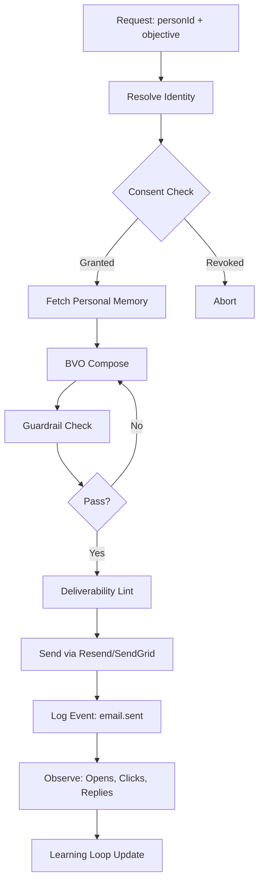
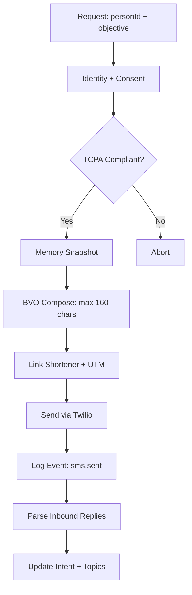
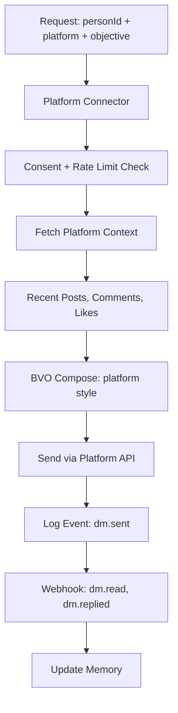

---
# NeonHub LoopDrive v1.0 - Agentic Marketing Architecture
---

## Overview

**LoopDrive** is NeonHub's identity-first, memory-powered, closed-loop agentic marketing system that personalizes every message across channels using:

- **Person Graph**: Cross-channel identity resolution with personal memory (pgvector)
- **Brand Voice Orchestrator (BVO)**: Hyper-personalized content generation with guardrails
- **Channel Agents**: Email, SMS, Social DM with context-aware composition
- **Learning Loop**: Outcome-driven optimization of prompts, snippets, and cadence
- **Budget Engine**: Smart spend allocation across channels with Stripe integration
- **SEO Agent**: Self-learning content generation aligned with search trends

---

## Core Principles

1. **Identity-first**: Every message/event ties to a single `PersonID` across channels
2. **Memory at the edge**: Each contact has a personal KB (facts + embeddings + history)
3. **Closed-loop learning**: Outcomes (opens, replies, bookings, purchases) feed back to improve future performance
4. **Compliance by default**: Consent + channel policy enforced before any send
5. **Brand consistency**: BVO ensures all generated content matches brand voice

---

## System Architecture

```
┌─────────────────────────────────────────────────────────────────────┐
│                        NeonHub LoopDrive System                     │
└─────────────────────────────────────────────────────────────────────┘
                                    │
                     ┌──────────────┴──────────────┐
                     │                             │
              ┌──────▼──────┐             ┌───────▼────────┐
              │   Person    │             │  Brand Voice   │
              │    Graph    │             │  Orchestrator  │
              │ (Identity + │             │   (GPT-5 +     │
              │   Memory)   │             │  Guardrails)   │
              └──────┬──────┘             └───────┬────────┘
                     │                             │
         ┌───────────┴───────────┬─────────────────┴──────┬────────┐
         │                       │                        │        │
    ┌────▼─────┐          ┌─────▼──────┐         ┌───────▼────┐   │
    │  Email   │          │    SMS     │         │  Social    │   │
    │  Agent   │          │   Agent    │         │    DM      │   │
    └────┬─────┘          └─────┬──────┘         │   Agent    │   │
         │                      │                └───────┬────┘   │
         └──────────┬───────────┴────────────────────────┘        │
                    │                                              │
              ┌─────▼──────┐                             ┌────────▼────┐
              │   Event    │                             │   Budget    │
              │   Stream   │                             │   Engine    │
              └─────┬──────┘                             └────────┬────┘
                    │                                             │
              ┌─────▼──────┐                             ┌────────▼────┐
              │  Learning  │◄────────────────────────────│   Wallet    │
              │    Loop    │         Outcomes            │  (Stripe)   │
              └────────────┘                             └─────────────┘
```

---

## Data Model

### Person Graph (Core Identity)

```typescript
Person {
  id: "per_..."
  workspaceId: string
  firstName, lastName, locale, timezone
  identities: Identity[]      // Email, phone, social handles
  consents: Consent[]         // Channel-level opt-in/out
  topics: Topic[]             // Learned interests with weights
  notes: Note[]               // Manual CRM notes
  memory: MemEmbedding[]      // pgvector personal KB
}

Identity {
  personId: "per_..."
  type: "email" | "phone" | "instagram" | "x" | ...
  value: string               // "user@example.com", "+1555..."
  verified: boolean
}

Consent {
  personId: "per_..."
  channel: "email" | "sms" | "dm" | ...
  scope: "marketing" | "transactional"
  status: "granted" | "revoked" | "unknown"
  source: "form" | "import" | "api"
  timestamp: DateTime
}

MemEmbedding {
  personId: "per_..."
  kind: "fact" | "intent" | "message" | "objection"
  text: string
  vector: pgvector(1536)      // OpenAI embedding
  confidence: 0-1
  expiresAt: DateTime?
}
```

### Event Stream (Immutable Log)

```typescript
Event {
  id: "evt_..."
  workspaceId: string
  personId: "per_..."
  type: "email.sent" | "email.opened" | "sms.replied" | "dm.read" | "conversion.purchase"
  channel: "email" | "sms" | "instagram" | ...
  source: "sendgrid" | "twilio" | "meta" | "gsc" | "stripe"
  payload: { ... }            // Event-specific data
  ts: DateTime
}
```

### Brand Voice

```typescript
BrandVoice {
  brandId: string
  tone: { formal: 0-100, playful: 0-100, confident: 0-100, ... }
  style: { sentenceLength, punctuation, emoji }
  vocabulary: { preferred: [], forbidden: [], replacements: {} }
  compliance: { regulations: ["CAN-SPAM", "GDPR", "TCPA"], ... }
}

SnippetLibrary {
  brandId: string
  snippet: string
  usage: "subject" | "opening" | "cta" | "ps"
  channel: "email" | "sms" | "dm"
  objective: "nurture" | "winback" | "demo_book" | ...
  winRate: 0-1
  impressions: number
  conversions: number
}
```

### Budget Engine

```typescript
BudgetAllocation {
  workspaceId: string
  totalBudget: number         // in cents
  strategy: "bandit" | "proportional" | "optimizer"
  channels: ChannelAllocation[]
  predictions: { conversions, revenue, ROAS }
  status: "draft" | "approved" | "executing" | "completed"
}

ChannelAllocation {
  channel: "email" | "sms" | "instagram" | ...
  objective: "demo_book" | "winback" | ...
  budget: number
  estimatedConversions: number
  estimatedROAS: number
}

Wallet {
  workspaceId: string
  balance: number             // in cents
  currency: "usd"
  autoReloadEnabled: boolean
  autoReloadThreshold: number
}
```

---

## Agent Pipelines

### Email Agent Flow



### SMS Agent Flow



### Social DM Agent Flow



---

## Learning Loop

### How It Works

1. **Snippet Ranking**: Track win-rate for every subject/opening/CTA snippet used
2. **Prompt Tuning**: Adjust template weights per objective/channel based on conversion rates
3. **Persona Shaping**: Update topic weights per person based on engagement patterns
4. **Cadence Optimization**: Learn best send times and frequency per person/channel

### Feedback Signals

| Signal                 | Source                  | Impact                              |
|------------------------|-------------------------|-------------------------------------|
| Email Open             | SendGrid Webhook        | +1 impression, update send time     |
| Email Click            | UTM params + GA4        | +topic weight, +snippet win         |
| Reply (positive)       | Sentiment analysis      | +conversational tone preference     |
| Meeting Booked         | Calendar API            | Strong conversion signal            |
| Purchase               | Stripe webhook          | Ultimate conversion, boost channel  |
| Unsubscribe            | Email webhook           | Reduce frequency, pause channel     |

### Example: Snippet Library Evolution

```
Initial State:
  Subject: "Quick question about your marketing stack"
    Impressions: 0, Conversions: 0, Win Rate: 0.5 (default)

After 100 sends:
  Subject: "Quick question about your marketing stack"
    Impressions: 100, Opens: 35, Clicks: 12, Meetings: 3
    Win Rate: 0.12 (3/100) → promoted in bandit selection

Top Performer (after 1000 sends):
  Subject: "Noticed you're using [Tool]—quick win for you?"
    Impressions: 1000, Opens: 420, Clicks: 180, Meetings: 45
    Win Rate: 0.45 → now used 70% of the time (bandit converged)
```

---

## Budget Engine

### Allocation Strategy: Thompson Sampling (Bandit)

1. **Input**: Total budget, objectives, historical performance
2. **Model**: Each channel is an "arm" with Beta(α, β) distribution
   - α = conversions + 1
   - β = non-conversions + 1
3. **Sample**: Draw expected conversion rate from each arm's distribution
4. **Allocate**: Assign budget proportional to sampled rates
5. **Execute**: Run campaigns
6. **Update**: Record actual conversions → update α, β

### Stripe Integration

#### Wallet Model

```typescript
// Client tops up wallet
POST /api/budget/wallet/:workspaceId/topup
  { amount: 500000 }  // $5000 in cents
→ Creates Stripe PaymentIntent
→ Adds WalletTransaction (credit)

// Campaign execution debits wallet
Budget Engine executes → 
  Email sends: 1000 × $0.01 = $10
  SMS sends: 200 × $0.05 = $10
  IG DMs: 50 × $0.10 = $5
→ Creates WalletTransaction (debit) for each

// Monthly invoice
Stripe Billing charges for SaaS subscription + variable usage
```

#### Payouts (Stripe Connect)

```typescript
// Pay creator for sponsored DM campaign
POST /api/budget/payout
  { recipientId: "creator_123", amount: 50000, description: "IG DM campaign" }
→ Creates Stripe Connect transfer
→ Logs in BudgetLedger as "creator" spend
```

---

## Tech Stack

### Backend

- **Runtime**: Node 20 + Express
- **Database**: PostgreSQL 16 + pgvector
- **ORM**: Prisma
- **Queue**: BullMQ (Redis)
- **LLM**: OpenAI GPT-5 via API
- **Embeddings**: OpenAI text-embedding-3-large

### Channels

- **Email**: Resend / SendGrid
- **SMS**: Twilio
- **Instagram**: Meta Graph API
- **X/Twitter**: Twitter API v2
- **Reddit**: Reddit OAuth2 API
- **WhatsApp**: WhatsApp Business API
- **Google Ads**: Google Ads API (budget allocation only)
- **Meta Ads**: Meta Marketing API (budget allocation only)

### Frontend

- **Framework**: Next.js 14 (App Router)
- **UI**: shadcn/ui + Tailwind CSS
- **Charts**: Recharts
- **State**: React Query (TanStack Query)

### Infrastructure

- **Database**: Neon.tech (PostgreSQL managed)
- **API**: Railway.app
- **Frontend**: Vercel
- **Redis**: Upstash
- **Storage**: Vercel Blob / S3

---

## Environment Variables

```bash
# Database
DATABASE_URL=postgresql://...
DIRECT_DATABASE_URL=postgresql://...

# LLM & Embeddings
OPENAI_API_KEY=sk-...

# Channels
RESEND_API_KEY=re_...
TWILIO_SID=AC...
TWILIO_AUTH_TOKEN=...
META_APP_ID=...
META_APP_SECRET=...

# Payments
STRIPE_SECRET_KEY=sk_...
STRIPE_WEBHOOK_SECRET=whsec_...

# Analytics
GA4_SVC_KEY=...
GSC_SVC_KEY=...

# Queue
REDIS_URL=redis://...

# Auth
NEXTAUTH_SECRET=...
NEXTAUTH_URL=https://...
```

---

## API Examples

### Person Resolution

```bash
curl -X POST https://api.neonhub.com/api/person/resolve \
  -H "Authorization: Bearer $API_KEY" \
  -d '{
    "email": "user@example.com"
  }'

# Response
{
  "person": {
    "id": "per_abc123",
    "workspaceId": "ws_xyz",
    "firstName": "Jane",
    "lastName": "Doe"
  },
  "identities": [
    { "type": "email", "value": "user@example.com", "verified": true },
    { "type": "phone", "value": "+15551234567", "verified": true }
  ],
  "matchedOn": ["email"],
  "confidence": 1.0
}
```

### Brand Voice Compose

```bash
curl -X POST https://api.neonhub.com/api/brand-voice/compose \
  -H "Authorization: Bearer $API_KEY" \
  -d '{
    "brandId": "brand_123",
    "channel": "email",
    "objective": "demo_book",
    "personId": "per_abc123",
    "constraints": {
      "maxLength": 500,
      "includeLink": true,
      "tone": "professional"
    }
  }'

# Response
{
  "primary": {
    "subject": "Quick question about your marketing stack, Jane",
    "body": "Hi Jane,\n\nI noticed you're using HubSpot...",
    "cta": "Book a 15-min demo",
    "ps": "P.S. We helped [Company] increase conversion by 40%"
  },
  "variants": [
    { "subject": "Saw you're using HubSpot—here's a quick win", ... },
    { "subject": "Jane, 15 minutes to transform your email ROI?", ... }
  ],
  "metadata": {
    "model": "gpt-5-turbo",
    "tokensUsed": 450,
    "latencyMs": 1200,
    "snippetsUsed": ["subj_789", "cta_456"]
  }
}
```

### Send Personalized Email

```bash
curl -X POST https://api.neonhub.com/api/email/send \
  -H "Authorization: Bearer $API_KEY" \
  -d '{
    "personId": "per_abc123",
    "brandId": "brand_123",
    "objective": "demo_book",
    "utmParams": {
      "source": "campaign",
      "medium": "email",
      "campaign": "q4_demo"
    }
  }'

# Response
{
  "id": "send_def456",
  "status": "queued",
  "personId": "per_abc123",
  "channel": "email",
  "sentAt": "2025-10-28T10:30:00Z"
}
```

### Budget Allocation

```bash
curl -X POST https://api.neonhub.com/api/budget/plan \
  -H "Authorization: Bearer $API_KEY" \
  -d '{
    "workspaceId": "ws_xyz",
    "objectives": [
      { "type": "demo_book", "priority": 10, "targetMetric": "conversions" }
    ],
    "constraints": {
      "totalBudget": 500000,
      "period": "monthly",
      "minROAS": 2.5
    },
    "strategy": "bandit"
  }'

# Response
{
  "id": "alloc_ghi789",
  "channels": [
    { "channel": "email", "budget": 200000, "estimatedConversions": 50, "estimatedROAS": 3.2 },
    { "channel": "sms", "budget": 150000, "estimatedConversions": 30, "estimatedROAS": 2.8 },
    { "channel": "instagram", "budget": 150000, "estimatedConversions": 25, "estimatedROAS": 2.6 }
  ],
  "predictions": {
    "totalConversions": 105,
    "averageROAS": 2.9
  },
  "status": "pending_approval"
}
```

---

## Deployment Checklist

- [ ] Database migrations applied (`pnpm db:migrate`)
- [ ] pgvector extension enabled
- [ ] Redis queue workers running (11 queues)
- [ ] Environment variables configured
- [ ] Stripe webhook endpoint verified
- [ ] Channel connector OAuth flows tested
- [ ] Brand voice configurations seeded
- [ ] Person graph seed data loaded
- [ ] CI/CD workflows updated (queue health checks)
- [ ] Monitoring dashboards deployed (Grafana)
- [ ] Slack alerting configured

---

## Next Steps

1. **Codex Backend Implementation**: Schema, services, agents, routes, queues
2. **Integration Layer**: Social platform connectors (IG, X, Reddit, WhatsApp)
3. **Frontend Components**: Person timeline, Brand Voice Playground, Budget Allocator
4. **Testing**: Integration tests for full flow (resolve → compose → send → observe → learn)
5. **Documentation**: API reference, developer guides, video walkthroughs

---

**Version**: 1.0.0  
**Last Updated**: 2025-10-28  
**Status**: 🚧 In Development (SDK complete, backend in progress via Codex)

