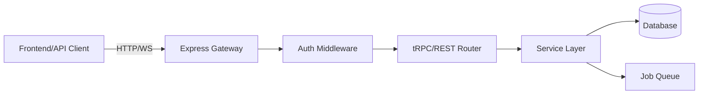

# NeonHub Backend API & Services

**Version:** 3.0+  
**Last Updated:** November 17, 2025  
**Framework:** Express + tRPC  
**Language:** TypeScript (Strict Mode)

---

## Table of Contents

1. [Overview](#overview)
2. [Architecture](#architecture)
3. [Directory Structure](#directory-structure)
4. [API Layers](#api-layers)
5. [tRPC Routers](#trpc-routers)
6. [REST Endpoints](#rest-endpoints)
7. [Service Layer](#service-layer)
8. [Middleware](#middleware)
9. [Authentication & Authorization](#authentication--authorization)
10. [Job Queues](#job-queues)
11. [WebSocket (Real-time)](#websocket-real-time)
12. [Error Handling](#error-handling)
13. [API Examples](#api-examples)
14. [Related Documentation](#related-documentation)

---

## Overview

The NeonHub backend is a **hybrid API** that provides:

- **tRPC endpoints** for type-safe communication with the Next.js frontend
- **REST endpoints** for external integrations, webhooks, and legacy support
- **WebSocket server** for real-time updates (Socket.io)
- **BullMQ job queues** for async processing

### Key Features

- **Type Safety:** End-to-end type safety via tRPC + Prisma
- **Multi-Tenancy:** Workspace-based isolation
- **Real-time:** WebSocket support for live updates
- **Async Processing:** BullMQ for background jobs
- **Observability:** Prometheus metrics, structured logging
- **Security:** JWT auth, rate limiting, input validation

### Technology Stack

```
┌─────────────────────────────────────────┐
│         Express.js HTTP Server          │
├─────────────────────────────────────────┤
│  tRPC API  │  REST API  │  WebSocket   │
├─────────────────────────────────────────┤
│         Service Layer (Business Logic)  │
├─────────────────────────────────────────┤
│    Prisma ORM    │    BullMQ Queues    │
├─────────────────────────────────────────┤
│  PostgreSQL (Neon.tech) │ Redis         │
└─────────────────────────────────────────┘
```

---

## Architecture

### Request Flow



### Layered Architecture

1. **HTTP Layer** - Express server, CORS, rate limiting
2. **Router Layer** - tRPC routers + REST routes
3. **Middleware Layer** - Auth, validation, logging
4. **Service Layer** - Business logic (isolated from transport)
5. **Data Layer** - Prisma ORM, database queries
6. **Integration Layer** - External APIs (OpenAI, Stripe, etc.)

---

## Directory Structure

```
apps/api/src/
├── server.ts                    # Main Express server entry point
├── config/                      # Configuration files
│   ├── env.ts                   # Environment variables
│   ├── database.ts              # Database config
│   └── redis.ts                 # Redis config
├── trpc/                        # tRPC API
│   ├── trpc.ts                  # tRPC initialization
│   ├── context.ts               # Request context
│   ├── middleware/              # tRPC middleware
│   │   ├── auth.ts              # Authentication middleware
│   │   ├── rateLimit.ts         # Rate limiting
│   │   └── logger.ts            # Request logging
│   ├── router.ts                # Root tRPC router
│   └── routers/                 # Individual tRPC routers
│       ├── agents.router.ts     # Agent management
│       ├── agent-runs.router.ts # Agent execution
│       ├── ai.router.ts         # AI utilities
│       ├── brand.router.ts      # Brand voice
│       ├── content.router.ts    # Content generation
│       ├── seo.router.ts        # SEO operations
│       └── trends.router.ts     # Trend monitoring
├── routes/                      # REST API routes
│   ├── agents.ts                # Agent CRUD
│   ├── analytics.ts             # Analytics endpoints
│   ├── auth.ts                  # Authentication
│   ├── billing.ts               # Stripe billing
│   ├── brand-voice.ts           # Brand voice upload
│   ├── campaign.ts              # Campaign management
│   ├── connectors.ts            # External service integrations
│   ├── content.ts               # Content management
│   ├── credentials.ts           # OAuth credentials
│   ├── email.ts                 # Email sending
│   ├── health.ts                # Health checks
│   ├── keywords.ts              # SEO keyword research
│   ├── metrics.ts               # Metrics & events
│   ├── oauth.ts                 # OAuth flows
│   ├── orchestrate.ts           # Agent orchestration
│   ├── person.ts                # Person identity management
│   ├── seo/                     # SEO endpoints
│   │   ├── content.ts           # SEO content optimization
│   │   ├── keywords.ts          # Keyword endpoints
│   │   ├── links.ts             # Internal linking
│   │   ├── meta.ts              # Meta tag generation
│   │   └── recommendations.ts   # SEO recommendations
│   ├── stripe-webhook.ts        # Stripe webhook handler
│   ├── support.ts               # Support ticket handling
│   ├── team.ts                  # Team management
│   └── trends.ts                # Trend detection
├── services/                    # Business logic services
│   ├── agent-learning.service.ts
│   ├── agent-run.service.ts
│   ├── analytics.service.ts
│   ├── brand-voice.service.ts
│   ├── budget.service.ts
│   ├── connector.service.ts
│   ├── content.service.ts
│   ├── credentials.service.ts
│   ├── email.service.ts
│   ├── feedback.service.ts
│   ├── keyword.service.ts
│   ├── learning-loop.service.ts
│   ├── messaging.service.ts
│   ├── oauth.service.ts
│   ├── person.service.ts
│   ├── seo.service.ts
│   ├── support.service.ts
│   ├── team.service.ts
│   ├── trends.service.ts
│   ├── billing/                 # Stripe billing
│   ├── budgeting/               # Budget allocation
│   ├── orchestration/           # Agent orchestration
│   ├── seo/                     # SEO services
│   │   ├── content-optimizer.service.ts
│   │   ├── internal-linking.service.ts
│   │   ├── keyword-research.service.ts
│   │   └── meta-generation.service.ts
│   └── ... (50+ service files)
├── agents/                      # AI agent implementations
│   ├── campaign.agent.ts
│   ├── content.agent.ts
│   ├── email.agent.ts
│   ├── insight.agent.ts
│   ├── seo.agent.ts
│   ├── social.agent.ts
│   └── support.agent.ts
├── ai/                          # AI utilities
│   ├── adapters/                # LLM adapters
│   ├── core/                    # AI core logic
│   ├── memory/                  # RAG memory
│   ├── policies/                # AI governance
│   ├── scoring/                 # Content scoring
│   ├── utils/                   # AI utilities
│   └── workflows/               # AI workflows
├── connectors/                  # External service integrations
│   ├── email/                   # Gmail, Outlook, Resend
│   ├── social/                  # Twitter, LinkedIn, Instagram
│   ├── sms/                     # Twilio, Vonage
│   ├── ads/                     # Google Ads, Facebook Ads
│   ├── analytics/               # GA4, Search Console
│   └── crm/                     # Salesforce, HubSpot
├── middleware/                  # Express middleware
│   ├── auth.ts                  # JWT authentication
│   ├── cors.ts                  # CORS configuration
│   ├── errorHandler.ts          # Error handling
│   ├── rateLimit.ts             # Rate limiting
│   ├── logger.ts                # Request logging
│   └── validator.ts             # Input validation
├── jobs/                        # BullMQ job processors
│   ├── email-send.job.ts
│   ├── content-generation.job.ts
│   ├── analytics-aggregation.job.ts
│   └── seo-optimization.job.ts
├── ws/                          # WebSocket handlers
│   └── index.ts                 # Socket.io server
├── db/                          # Database utilities
│   └── prisma.ts                # Prisma client instance
├── lib/                         # Shared utilities
│   ├── logger.ts                # Winston logger
│   ├── errors.ts                # Custom error classes
│   ├── metrics.ts               # Prometheus metrics
│   └── validators.ts            # Zod schemas
└── types/                       # TypeScript types
    ├── api.ts
    ├── auth.ts
    └── ... (type definitions)
```

---

## API Layers

### 1. tRPC API (Primary)

**Purpose:** Type-safe RPC for frontend communication

**Base URL:** `/trpc`

**Features:**
- Full TypeScript type inference
- Automatic request/response validation
- Built-in error handling
- React Query integration

**Example:**
```typescript
// Frontend usage
const { data, isLoading } = trpc.agents.list.useQuery({ workspaceId });
```

### 2. REST API (Secondary)

**Purpose:** External integrations, webhooks, public APIs

**Base URL:** `/api`

**Features:**
- Standard HTTP verbs (GET, POST, PUT, DELETE)
- JSON request/response
- OpenAPI documentation (planned)

**Example:**
```bash
curl -X POST https://api.neonhubecosystem.com/api/content/generate \
  -H "Authorization: Bearer <token>" \
  -H "Content-Type: application/json" \
  -d '{"workspaceId": "...", "prompt": "..."}'
```

### 3. WebSocket API

**Purpose:** Real-time updates

**Endpoint:** `wss://api.neonhubecosystem.com`

**Events:**
- `agent:run:start` - Agent execution started
- `agent:run:progress` - Agent execution progress
- `agent:run:complete` - Agent execution complete
- `metrics:update` - New metrics available

---

## tRPC Routers

### 1. agents.router.ts - Agent Management

**Procedures:**
- `agents.list` - List all agents in workspace
- `agents.get` - Get agent by ID
- `agents.create` - Create new agent
- `agents.update` - Update agent configuration
- `agents.delete` - Delete agent (soft delete)
- `agents.toggle` - Enable/disable agent

### 2. agent-runs.router.ts - Agent Execution

**Procedures:**
- `agentRuns.list` - List agent runs
- `agentRuns.get` - Get run details with tool executions
- `agentRuns.create` - Execute agent (async)
- `agentRuns.metrics` - Get execution metrics

### 3. ai.router.ts - AI Utilities

**Procedures:**
- `ai.generateText` - Generate text with LLM
- `ai.generateImage` - Generate image with DALL-E
- `ai.embed` - Generate embeddings
- `ai.score` - Score content quality

### 4. brand.router.ts - Brand Voice

**Procedures:**
- `brand.uploadGuide` - Upload brand voice document
- `brand.getContext` - RAG retrieval for brand context
- `brand.analyze` - Analyze text for brand alignment

### 5. content.router.ts - Content Generation

**Procedures:**
- `content.generate` - Generate content from prompt
- `content.optimize` - Optimize existing content
- `content.list` - List content drafts
- `content.get` - Get content by ID
- `content.publish` - Publish content
- `content.suggestInternalLinks` - Suggest internal links

### 6. seo.router.ts - SEO Operations

**Procedures:**
- `seo.discoverKeywords` - Keyword discovery with clustering
- `seo.analyzeIntent` - Search intent classification
- `seo.scoreDifficulty` - Competition analysis
- `seo.generateMeta` - Meta tag generation
- `seo.getMetrics` - GA4/GSC analytics data
- `seo.getTrends` - Performance trends

### 7. trends.router.ts - Trend Monitoring

**Procedures:**
- `trends.detect` - Detect trending topics
- `trends.analyze` - Analyze trend opportunity
- `trends.track` - Track specific trend
- `trends.list` - List tracked trends

**See:** [`docs/API_SURFACE.md`](./API_SURFACE.md) for complete API reference

---

## REST Endpoints

### Core Endpoints

#### Authentication
- `POST /api/auth/login` - Login with credentials
- `POST /api/auth/register` - Create account
- `POST /api/auth/logout` - Logout
- `POST /api/auth/refresh` - Refresh JWT token

#### Health & Monitoring
- `GET /health` - Health check
- `GET /metrics` - Prometheus metrics

#### Webhooks
- `POST /api/stripe-webhook` - Stripe webhook handler
- `POST /api/oauth/callback` - OAuth callback

### Domain Endpoints

**Agents:**
- `GET /api/agents` - List agents
- `POST /api/agents` - Create agent
- `GET /api/agents/:id` - Get agent
- `PUT /api/agents/:id` - Update agent
- `DELETE /api/agents/:id` - Delete agent
- `POST /api/agents/:id/execute` - Execute agent

**Content:**
- `GET /api/content` - List content
- `POST /api/content/generate` - Generate content
- `GET /api/content/:id` - Get content
- `PUT /api/content/:id` - Update content
- `POST /api/content/:id/publish` - Publish content

**SEO:**
- `POST /api/seo/keywords/discover` - Keyword discovery
- `POST /api/seo/meta/generate` - Meta generation
- `POST /api/seo/links/suggest` - Internal links
- `GET /api/seo/metrics` - SEO metrics

**Analytics:**
- `POST /api/analytics/track` - Track event
- `GET /api/analytics/summary` - Get summary stats

**See:** Full endpoint list in [`docs/AGENT_API.md`](./AGENT_API.md) and [`docs/SEO_API_REFERENCE.md`](./SEO_API_REFERENCE.md)

---

## Service Layer

Services encapsulate business logic and are transport-agnostic (can be called from tRPC, REST, or jobs).

### Service Pattern

```typescript
// services/content.service.ts
export class ContentService {
  constructor(
    private prisma: PrismaClient,
    private llmAdapter: LLMAdapter
  ) {}
  
  async generateContent(params: GenerateContentParams): Promise<ContentDraft> {
    // 1. Validate input
    // 2. Get brand context (RAG)
    // 3. Generate with LLM
    // 4. Score quality
    // 5. Save to database
    // 6. Return result
  }
}
```

### Key Services

**Agent Services:**
- `agent-run.service.ts` - Execute agents
- `agent-learning.service.ts` - Learning loop
- `tool-execution.service.ts` - Tool execution

**Content Services:**
- `content.service.ts` - Content generation
- `brand-voice.service.ts` - Brand voice RAG
- `editorial-calendar.service.ts` - Content calendar

**SEO Services:**
- `seo/keyword-research.service.ts` - Keyword research
- `seo/content-optimizer.service.ts` - Content optimization
- `seo/internal-linking.service.ts` - Link suggestions
- `seo/meta-generation.service.ts` - Meta tag generation

**Analytics Services:**
- `analytics.service.ts` - Analytics aggregation
- `feedback.service.ts` - Feedback processing
- `learning-loop.service.ts` - Performance learning

**Integration Services:**
- `connector.service.ts` - External connectors
- `oauth.service.ts` - OAuth flows
- `credentials.service.ts` - Credential management
- `email.service.ts` - Email sending
- `messaging.service.ts` - Multi-channel messaging

**Business Services:**
- `billing/stripe.ts` - Stripe billing
- `budget.service.ts` - Budget management
- `budgeting/allocation-engine.ts` - Budget allocation
- `team.service.ts` - Team management

---

## Middleware

### Authentication Middleware

```typescript
// middleware/auth.ts
export async function authMiddleware(req, res, next) {
  const token = req.headers.authorization?.replace('Bearer ', '');
  if (!token) throw new UnauthorizedError();
  
  const decoded = verifyJWT(token);
  req.user = await prisma.user.findUnique({ where: { id: decoded.userId } });
  
  next();
}
```

### Rate Limiting

```typescript
// middleware/rateLimit.ts
import rateLimit from 'express-rate-limit';

export const apiLimiter = rateLimit({
  windowMs: 1 * 60 * 1000, // 1 minute
  max: 100, // 100 requests per minute
  standardHeaders: true,
  legacyHeaders: false
});
```

### Error Handling

```typescript
// middleware/errorHandler.ts
export function errorHandler(err, req, res, next) {
  logger.error('Error:', err);
  
  if (err instanceof ValidationError) {
    return res.status(400).json({ error: err.message });
  }
  
  if (err instanceof UnauthorizedError) {
    return res.status(401).json({ error: 'Unauthorized' });
  }
  
  res.status(500).json({ error: 'Internal server error' });
}
```

---

## Authentication & Authorization

### JWT Authentication

**Flow:**
1. User logs in → Backend generates JWT
2. Frontend stores JWT in localStorage
3. Frontend includes JWT in Authorization header
4. Backend verifies JWT on each request

**Token Structure:**
```typescript
{
  userId: string;
  email: string;
  workspaceIds: string[];
  iat: number;  // issued at
  exp: number;  // expires at (24 hours)
}
```

### Workspace Authorization

Every request must include `workspaceId` parameter. Backend verifies:
1. User is authenticated
2. User is a member of the workspace
3. User has required permissions

```typescript
// Example tRPC middleware
const isAuthed = t.middleware(async ({ ctx, next }) => {
  if (!ctx.user) throw new TRPCError({ code: 'UNAUTHORIZED' });
  return next({ ctx: { user: ctx.user } });
});

const hasWorkspaceAccess = t.middleware(async ({ ctx, input, next }) => {
  const member = await prisma.workspaceMember.findFirst({
    where: { workspaceId: input.workspaceId, userId: ctx.user.id }
  });
  
  if (!member) throw new TRPCError({ code: 'FORBIDDEN' });
  
  return next({ ctx: { ...ctx, workspace: member.workspace } });
});
```

---

## Job Queues

### BullMQ Configuration

```typescript
// queues/config.ts
import { Queue } from 'bullmq';

export const emailQueue = new Queue('email', {
  connection: {
    host: process.env.REDIS_HOST,
    port: Number(process.env.REDIS_PORT),
    password: process.env.REDIS_PASSWORD
  }
});
```

### Job Types

1. **Email Queue** - Send emails
2. **Content Queue** - Generate content
3. **Analytics Queue** - Aggregate metrics
4. **SEO Queue** - Run SEO analysis
5. **Agent Queue** - Execute long-running agents

### Job Pattern

```typescript
// jobs/email-send.job.ts
export async function processEmailJob(job) {
  const { to, subject, body } = job.data;
  
  await sendEmail({ to, subject, body });
  
  // Track metrics
  await prisma.metricEvent.create({
    data: { kind: 'email_sent', metadata: { to } }
  });
}
```

---

## WebSocket (Real-time)

### Socket.io Server

```typescript
// ws/index.ts
import { Server } from 'socket.io';

export function setupWebSocket(server) {
  const io = new Server(server, {
    cors: { origin: process.env.CORS_ORIGINS }
  });
  
  io.on('connection', (socket) => {
    console.log('Client connected:', socket.id);
    
    socket.on('subscribe:workspace', (workspaceId) => {
      socket.join(`workspace:${workspaceId}`);
    });
  });
  
  return io;
}
```

### Emitting Events

```typescript
// services/agent-run.service.ts
export class AgentRunService {
  async executeAgent(agentId, input) {
    const run = await prisma.agentRun.create({ ... });
    
    // Emit start event
    io.to(`workspace:${workspaceId}`).emit('agent:run:start', { runId: run.id });
    
    // Execute agent...
    
    // Emit complete event
    io.to(`workspace:${workspaceId}`).emit('agent:run:complete', { runId: run.id, output });
  }
}
```

---

## Error Handling

### Custom Error Classes

```typescript
// lib/errors.ts
export class APIError extends Error {
  constructor(
    public statusCode: number,
    public message: string,
    public code?: string
  ) {
    super(message);
  }
}

export class ValidationError extends APIError {
  constructor(message: string) {
    super(400, message, 'VALIDATION_ERROR');
  }
}

export class UnauthorizedError extends APIError {
  constructor() {
    super(401, 'Unauthorized', 'UNAUTHORIZED');
  }
}

export class NotFoundError extends APIError {
  constructor(resource: string) {
    super(404, `${resource} not found`, 'NOT_FOUND');
  }
}
```

### Error Response Format

```json
{
  "error": {
    "code": "VALIDATION_ERROR",
    "message": "Invalid input: email is required",
    "details": {
      "field": "email",
      "constraint": "required"
    }
  }
}
```

---

## API Examples

### tRPC Usage (Frontend)

```typescript
// Generate content
const { mutateAsync: generateContent } = trpc.content.generate.useMutation();

const result = await generateContent({
  workspaceId,
  prompt: 'Write a blog post about AI trends',
  kind: 'article'
});
```

### REST Usage (External)

```bash
# Get agent list
curl -X GET https://api.neonhubecosystem.com/api/agents \
  -H "Authorization: Bearer <token>" \
  -H "X-Workspace-ID: <workspaceId>"

# Execute agent
curl -X POST https://api.neonhubecosystem.com/api/agents/ag_123/execute \
  -H "Authorization: Bearer <token>" \
  -H "Content-Type: application/json" \
  -d '{"input": {"prompt": "Generate campaign ideas"}}'
```

### WebSocket Usage (Frontend)

```typescript
import io from 'socket.io-client';

const socket = io('wss://api.neonhubecosystem.com');

socket.emit('subscribe:workspace', workspaceId);

socket.on('agent:run:start', (data) => {
  console.log('Agent started:', data.runId);
});

socket.on('agent:run:complete', (data) => {
  console.log('Agent complete:', data.runId, data.output);
});
```

---

## Related Documentation

### API Documentation
- [`docs/API_SURFACE.md`](./API_SURFACE.md) - Complete API surface
- [`docs/AGENT_API.md`](./AGENT_API.md) - Agent-specific endpoints
- [`docs/SEO_API_REFERENCE.md`](./SEO_API_REFERENCE.md) - SEO endpoint reference
- [`docs/ORCHESTRATION_GUIDE.md`](./ORCHESTRATION_GUIDE.md) - Agent orchestration
- [`docs/ORCHESTRATOR_CONTRACTS.md`](./ORCHESTRATOR_CONTRACTS.md) - API contracts

### Implementation Documentation
- [`docs/AGENT_INFRASTRUCTURE_AND_AI_LOGIC.md`](./AGENT_INFRASTRUCTURE_AND_AI_LOGIC.md) - Agent implementation
- [`docs/AI_LOGIC_RUNBOOK.md`](./AI_LOGIC_RUNBOOK.md) - AI operations
- [`docs/AI_LLM_ADAPTERS.md`](./AI_LLM_ADAPTERS.md) - LLM adapter guide
- [`docs/BOOTSTRAP_WIRING.md`](./BOOTSTRAP_WIRING.md) - System initialization

### Operations
- [`docs/OBSERVABILITY_GUIDE.md`](./OBSERVABILITY_GUIDE.md) - Monitoring setup
- [`docs/SECURITY_CHECKLIST.md`](./SECURITY_CHECKLIST.md) - Security best practices

---

**Document Version:** 1.0  
**Last Updated:** November 17, 2025  
**Maintained By:** NeonHub Backend Team  
**Next Review:** December 1, 2025

