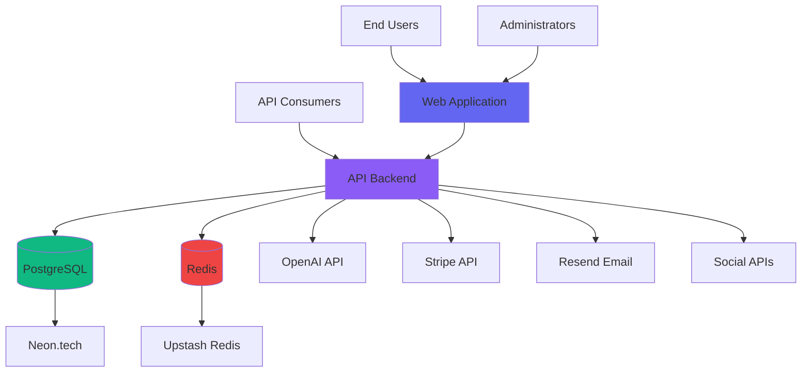
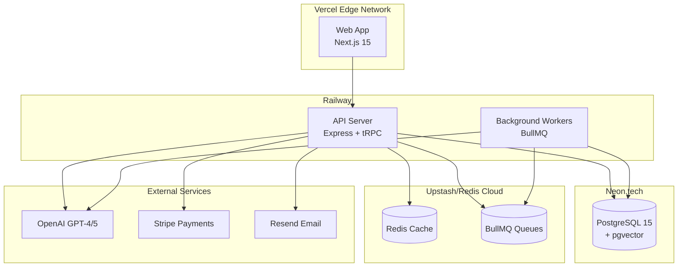

# NeonHub System Architecture

**Version:** 3.0+  
**Last Updated:** November 17, 2025  
**Status:** Production Architecture Documentation

---

## Table of Contents

1. [Overview](#overview)
2. [Architectural Principles](#architectural-principles)
3. [High-Level Architecture](#high-level-architecture)
4. [Monorepo Structure](#monorepo-structure)
5. [Application Layer](#application-layer)
6. [Core Packages](#core-packages)
7. [Data Architecture](#data-architecture)
8. [AI & Agent Architecture](#ai--agent-architecture)
9. [Integration Architecture](#integration-architecture)
10. [Security Architecture](#security-architecture)
11. [Deployment Architecture](#deployment-architecture)
12. [Scalability & Performance](#scalability--performance)
13. [Related Documentation](#related-documentation)

---

## Overview

NeonHub is built as a **modular monorepo** using pnpm workspaces, with a clear separation between applications (`apps/`), core shared packages (`core/`), and specialized modules (`modules/`). The architecture supports:

- **Multi-tenancy:** Workspace-based isolation
- **Microservices-ready:** Core packages can be deployed independently
- **Event-driven:** BullMQ queues for async processing
- **Real-time:** WebSocket support via Socket.io
- **AI-native:** Seven specialized agents with learning loops
- **Global scale:** Multi-region deployment ready

### Architecture Highlights

```
┌────────────────────────────────────────────────────────────┐
│                    Load Balancer (Vercel/Railway)          │
└─────────────────┬──────────────────────┬───────────────────┘
                  │                      │
        ┌─────────▼─────────┐  ┌─────────▼──────────┐
        │   Web Frontend    │  │    API Backend     │
        │   (Next.js 15)    │  │  (Express + tRPC)  │
        │   apps/web/       │  │    apps/api/       │
        └─────────┬─────────┘  └─────────┬──────────┘
                  │                      │
                  └──────────┬───────────┘
                             │
         ┌───────────────────┼───────────────────┐
         │                   │                   │
    ┌────▼─────┐      ┌─────▼──────┐    ┌──────▼──────┐
    │ Postgres │      │   Redis    │    │   AI APIs   │
    │ (Neon)   │      │  (Cache+   │    │  (OpenAI,   │
    │          │      │   Queue)   │    │   Claude)   │
    └──────────┘      └────────────┘    └─────────────┘
```

---

## Architectural Principles

### 1. Separation of Concerns
- **Apps:** User-facing applications (API, Web)
- **Core:** Reusable business logic packages
- **Modules:** Specialized, independently deployable services

### 2. Type Safety First
- TypeScript strict mode across all packages
- Zod schemas for runtime validation
- tRPC for end-to-end type safety (API ↔ Web)
- Prisma for type-safe database access

### 3. Composition Over Inheritance
- Small, focused packages with single responsibilities
- Dependency injection for flexibility
- Plugin-based extensibility (LLM adapters, connectors)

### 4. Event-Driven Architecture
- BullMQ for async job processing
- WebSocket for real-time updates
- Event sourcing for audit trails

### 5. Security by Default
- No secrets in code (environment variables)
- Principle of least privilege (database roles)
- Input validation at every boundary
- Rate limiting and CORS protection

### 6. Observable & Debuggable
- Structured logging (Winston)
- Distributed tracing (OpenTelemetry compatible)
- Prometheus metrics
- Health checks at every service

---

## High-Level Architecture

### System Context Diagram



### Container Diagram



---

## Monorepo Structure

### Directory Layout

```
NeonHub/
├── apps/                           # User-facing applications
│   ├── api/                        # Backend API server
│   │   ├── src/
│   │   │   ├── agents/             # AI agent implementations
│   │   │   ├── ai/                 # AI utilities & adapters
│   │   │   ├── connectors/         # External service integrations
│   │   │   ├── routes/             # REST endpoints
│   │   │   ├── services/           # Business logic services
│   │   │   ├── trpc/               # tRPC routers
│   │   │   ├── middleware/         # Express middleware
│   │   │   ├── jobs/               # BullMQ job definitions
│   │   │   └── server.ts           # Main entry point
│   │   ├── prisma/
│   │   │   ├── schema.prisma       # Database schema
│   │   │   ├── migrations/         # Database migrations
│   │   │   └── seed.ts             # Seed data
│   │   └── package.json
│   │
│   └── web/                        # Frontend web application
│       ├── src/
│       │   ├── app/                # Next.js 15 app router
│       │   │   ├── (auth)/         # Auth pages
│       │   │   ├── dashboard/      # Main dashboard
│       │   │   ├── agents/         # Agent management
│       │   │   ├── campaigns/      # Campaign management
│       │   │   ├── content/        # Content hub
│       │   │   ├── analytics/      # Analytics dashboard
│       │   │   └── settings/       # Settings pages
│       │   ├── components/         # React components
│       │   │   ├── ui/             # shadcn/ui components
│       │   │   ├── dashboard/      # Dashboard components
│       │   │   ├── agents/         # Agent UI components
│       │   │   └── marketing/      # Marketing components
│       │   ├── lib/                # Utilities
│       │   │   ├── api.ts          # API client
│       │   │   ├── trpc.ts         # tRPC client
│       │   │   └── utils.ts        # Helpers
│       │   └── styles/             # Global styles
│       └── package.json
│
├── core/                           # Shared core packages
│   ├── ai-governance/              # Policy engine, ethics, compliance
│   ├── ai-economy/                 # Token management, pricing
│   ├── cognitive-ethics/           # Ethical AI evaluators
│   ├── cognitive-infra/            # Learning & adaptation
│   ├── compliance-consent/         # GDPR/CCPA compliance
│   ├── data-trust/                 # Data provenance, blockchain
│   ├── eco-optimizer/              # Energy & sustainability
│   ├── federation/                 # Multi-node coordination
│   ├── llm-adapter/                # LLM abstraction layer
│   ├── memory-rag/                 # Vector memory & RAG
│   ├── orchestrator-ai/            # Agent orchestration
│   ├── orchestrator-global/        # Global orchestration
│   ├── prompt-registry/            # Prompt management
│   ├── qa-sentinel/                # Quality assurance
│   ├── sdk/                        # Client SDK
│   ├── telemetry/                  # Observability
│   └── tools-framework/            # Tool execution framework
│
├── modules/                        # Specialized modules
│   └── predictive-engine/          # ML prediction & scaling
│
├── scripts/                        # Build & automation scripts
│   ├── build/                      # Build scripts
│   ├── ci-cd/                      # CI/CD utilities
│   ├── db-*.sh                     # Database scripts
│   ├── smoke-*.sh                  # Smoke tests
│   └── deploy-*.sh                 # Deployment scripts
│
├── docs/                           # Documentation
│   ├── NEONHUB_OVERVIEW.md         # Project overview (you should read this!)
│   ├── SYSTEM_ARCHITECTURE.md      # This file
│   ├── DATABASE_AND_DATA_MODEL.md  # Database documentation
│   ├── BACKEND_API_AND_SERVICES.md # Backend documentation
│   ├── AGENT_INFRASTRUCTURE_AND_AI_LOGIC.md # Agent docs
│   └── ... (many more)
│
├── .github/                        # GitHub configuration
│   └── workflows/                  # CI/CD workflows
│       ├── ci.yml                  # Main CI pipeline
│       ├── db-deploy.yml           # Database deployment
│       ├── db-drift-check.yml      # Schema drift detection
│       └── security-preflight.yml  # Security checks
│
├── pnpm-workspace.yaml             # pnpm workspace config
├── package.json                    # Root package.json
└── tsconfig.json                   # Root TypeScript config
```

---

## Application Layer

### apps/api - Backend API Server

**Purpose:** Core backend API serving both REST and tRPC endpoints.

**Key Components:**

1. **Express Server (`server.ts`)**
   - HTTP server on port 3001 (configurable)
   - CORS, helmet, rate limiting middleware
   - Health check endpoint: `/health`
   - Static file serving

2. **tRPC Router (`trpc/`)**
   - Type-safe RPC endpoints
   - Routers: agents, content, campaigns, analytics, seo, brand, etc.
   - Middleware: authentication, rate limiting, logging
   - Context: user session, database, logger

3. **REST Routes (`routes/`)**
   - Legacy REST endpoints for external integrations
   - Webhook handlers (Stripe, Resend, OAuth)
   - Public endpoints (health, metrics)

4. **Services Layer (`services/`)**
   - Business logic separated from routes
   - Examples: `campaign.service.ts`, `content.service.ts`, `seo.service.ts`
   - Repository pattern for database access

5. **Agents (`agents/`)**
   - Seven AI agents (see [AI & Agent Architecture](#ai--agent-architecture))
   - Agent orchestrator
   - Learning loop implementation

6. **Connectors (`connectors/`)**
   - External service integrations
   - OAuth flows
   - Credential management
   - Mock connectors for development

7. **Jobs (`jobs/`)**
   - BullMQ job processors
   - Async tasks: email sending, content generation, analytics aggregation
   - Retry logic and error handling

8. **Middleware (`middleware/`)**
   - Authentication (JWT, session)
   - Authorization (RBAC)
   - Rate limiting
   - Request logging
   - Error handling

### apps/web - Frontend Web Application

**Purpose:** User-facing web application built with Next.js 15.

**Key Components:**

1. **App Router (`app/`)**
   - Next.js 15 app directory structure
   - Server components by default
   - Client components where needed (`'use client'`)
   - Route groups for organization

2. **Pages & Routes**
   - `/` - Landing page
   - `/dashboard` - Main dashboard
   - `/agents` - Agent management
   - `/campaigns` - Campaign management
   - `/content` - Content hub
   - `/email` - Email campaigns
   - `/social-media` - Social media management
   - `/analytics` - Analytics dashboard
   - `/trends` - Trend monitoring
   - `/brand-voice` - Brand voice configuration
   - `/settings` - User settings

3. **Components (`components/`)**
   - **ui/**: shadcn/ui primitives (Button, Dialog, Card, etc.)
   - **dashboard/**: Dashboard-specific components
   - **agents/**: Agent UI components
   - **marketing/**: Marketing campaign components
   - **charts/**: Analytics charts (Recharts)

4. **API Client (`lib/`)**
   - tRPC client with React Query
   - WebSocket client (Socket.io)
   - API helpers and utilities

5. **Design System**
   - Tailwind CSS for styling
   - Custom "neon glass" theme
   - Dark mode support (next-themes)
   - CSS variables for theming

6. **Authentication**
   - NextAuth.js configuration
   - GitHub OAuth provider
   - Credentials provider (email/password)
   - Protected routes with middleware

---

## Core Packages

Detailed documentation for each core package. All packages follow a consistent structure:

```
core/package-name/
├── src/
│   ├── index.ts          # Public API exports
│   ├── types/            # TypeScript types
│   └── core/             # Implementation
├── package.json
├── tsconfig.json
└── README.md             # Package-specific documentation
```

### 1. ai-governance

**Purpose:** Policy enforcement, ethical AI compliance, legal compliance

**Exports:**
- `PolicyEngine` - Evaluate actions against policies
- `EthicalFramework` - Assess ethical impact (beneficence, autonomy, justice, etc.)
- `LegalComplianceManager` - GDPR, CCPA, HIPAA compliance checks
- `AuditLogger` - Immutable audit trails

**Use Cases:**
- Enforce content policies before generation
- Ensure ethical use of AI
- Maintain legal compliance records

**See:** [`docs/v6.0/ARCHITECTURE.md`](./v6.0/ARCHITECTURE.md) for detailed governance architecture

### 2. data-trust

**Purpose:** Data provenance, integrity verification, blockchain integration

**Exports:**
- `DataHasher` - Cryptographic hashing (SHA-256, SHA-3, Blake2b)
- `ProvenanceTracker` - Track data lineage and modifications
- `BlockchainConnector` - Store hashes on Ethereum, Polygon, BSC
- `IntegrityVerifier` - Verify data hasn't been tampered with

**Use Cases:**
- Audit trail for generated content
- Prove content authenticity
- Detect unauthorized modifications

### 3. eco-optimizer

**Purpose:** Energy monitoring, carbon footprint calculation, sustainability

**Exports:**
- `EnergyMonitor` - Track energy usage across cloud providers
- `CarbonFootprintCalculator` - Calculate CO2e emissions
- `ResourceOptimizer` - AI-powered efficiency recommendations
- `GreenAIAdvisor` - Sustainability best practices

**Use Cases:**
- Monitor environmental impact
- Optimize resource allocation
- Meet sustainability goals

### 4. federation

**Purpose:** Multi-region coordination, distributed operations

**Exports:**
- `FederationClient` - Coordinate across regions
- `RegionManager` - Manage regional resources
- `WorkloadDistributor` - Distribute load geographically

**Use Cases:**
- Global deployments
- Data residency compliance
- Low-latency regional routing

### 5. llm-adapter

**Purpose:** Unified interface for multiple LLM providers

**Exports:**
- `LLMAdapter` - Abstract LLM interface
- `OpenAIAdapter` - OpenAI GPT-3.5/4/5
- `ClaudeAdapter` - Anthropic Claude
- `OllamaAdapter` - Local Ollama models

**Use Cases:**
- Switch between LLM providers
- A/B test different models
- Local development with Ollama
- Cost optimization

**See:** [`docs/AI_LLM_ADAPTERS.md`](./AI_LLM_ADAPTERS.md) for adapter details

### 6. memory-rag

**Purpose:** Vector memory, RAG (Retrieval Augmented Generation)

**Exports:**
- `VectorStore` - pgvector integration
- `EmbeddingService` - Generate embeddings
- `RAGPipeline` - Retrieve context + generate
- `MemoryManager` - Manage agent memory

**Use Cases:**
- Brand voice consistency
- Context-aware content generation
- Knowledge base search
- Agent memory across sessions

### 7. orchestrator-ai

**Purpose:** AI agent orchestration, task decomposition

**Exports:**
- `AgentOrchestrator` - Coordinate multiple agents
- `TaskDecomposer` - Break complex tasks into subtasks
- `AgentRouter` - Route tasks to appropriate agents

**Use Cases:**
- Complex multi-agent workflows
- Automatic task delegation
- Sequential agent chaining

**See:** [`docs/ORCHESTRATION_GUIDE.md`](./ORCHESTRATION_GUIDE.md)

### 8. orchestrator-global

**Purpose:** Global infrastructure orchestration, auto-scaling

**Exports:**
- `NodeDiscoveryService` - Discover federation nodes
- `IntelligentRoutingService` - Route to optimal nodes
- `AutoScalingService` - Horizontal and vertical scaling
- `FailoverService` - High availability failover

**Use Cases:**
- Multi-region deployments
- Auto-scaling based on load
- Disaster recovery

**See:** [`docs/v6.0/ARCHITECTURE.md`](./v6.0/ARCHITECTURE.md) for orchestration details

### 9. prompt-registry

**Purpose:** Centralized prompt management, versioning, A/B testing

**Exports:**
- `PromptRegistry` - Store and retrieve prompts
- `PromptVersionManager` - Version control for prompts
- `PromptTester` - A/B test prompt variants

**Use Cases:**
- Centralized prompt management
- Improve prompts without code changes
- Track prompt performance

**See:** [`docs/PROMPT_REGISTRY_GUIDE.md`](./PROMPT_REGISTRY_GUIDE.md)

### 10. qa-sentinel

**Purpose:** Automated quality assurance, testing, validation

**Exports:**
- `ContentValidator` - Validate generated content
- `ComplianceChecker` - Check regulatory compliance
- `QualityScorer` - Score content quality

**Use Cases:**
- Pre-publish content validation
- Automated compliance checks
- Quality gates in CI/CD

### 11. sdk

**Purpose:** Client SDK for integrating with NeonHub

**Exports:**
- `NeonHubClient` - Main SDK client
- `AgentAPI` - Agent management
- `CampaignAPI` - Campaign operations
- `ContentAPI` - Content generation

**Use Cases:**
- Embed NeonHub in external apps
- Build custom integrations
- Programmatic access

**See:** [`core/sdk/README.md`](../core/sdk/README.md)

### 12. telemetry

**Purpose:** Observability, metrics, distributed tracing

**Exports:**
- `Logger` - Structured logging (Winston)
- `MetricsCollector` - Prometheus metrics
- `Tracer` - Distributed tracing (OpenTelemetry)

**Use Cases:**
- Debug production issues
- Monitor performance
- Track business metrics

### 13. tools-framework

**Purpose:** Extensible tool execution for AI agents

**Exports:**
- `ToolExecutor` - Execute arbitrary tools
- `ToolRegistry` - Register custom tools
- `ToolValidator` - Validate tool inputs/outputs

**Use Cases:**
- Extend agent capabilities
- Custom integrations
- Safe tool execution

---

## Data Architecture

### Database: PostgreSQL with pgvector

**Primary Database:** Neon.tech serverless PostgreSQL 15+

**Extensions:**
- **pgvector:** Vector similarity search for embeddings
- **citext:** Case-insensitive text columns

### Schema Overview

**40+ models organized by domain:**

1. **Authentication & Authorization**
   - User, Account, Session, VerificationToken
   - Workspace, WorkspaceMember (multi-tenancy)

2. **AI Agents & Execution**
   - Agent, AgentRun, ToolExecution
   - Conversation, ConversationMessage
   - Dataset, TrainJob

3. **Content & Campaigns**
   - ContentDraft, ContentVersion
   - MarketingCampaign, MarketingCampaignPerformance
   - MarketingLead, MarketingTouchpoint

4. **Identity & Consent** (LoopDrive)
   - Person, Identity, Consent
   - Note, Topic, MemEmbedding (pgvector)

5. **Connectors & Credentials**
   - Connector, ConnectorInstance
   - OAuthToken, ApiKey

6. **Analytics & Metrics**
   - MetricEvent, AgentMetrics
   - AnalyticsSummary

7. **SEO & Brand**
   - BrandVoiceGuide, BrandVoiceEmbedding (pgvector)
   - KeywordResearch, KeywordCluster
   - InternalLink, ContentAnalysis

**See:** [`docs/DATABASE_AND_DATA_MODEL.md`](./DATABASE_AND_DATA_MODEL.md) for complete schema documentation

### Data Flow Patterns

1. **Read-Heavy Queries**
   - Use read replicas (Neon branching)
   - Aggressive caching in Redis
   - Materialized views for analytics

2. **Write-Heavy Operations**
   - Async processing via BullMQ
   - Batch inserts for metrics
   - Optimistic locking for concurrent updates

3. **Vector Similarity Search**
   - pgvector index on embeddings
   - Cosine similarity for RAG
   - HNSW index for performance

---

## AI & Agent Architecture

### LoopDrive: Agentic Marketing System

**Core Concept:** Identity-first, memory-powered, closed-loop learning system.

**See:** [`AGENTIC_ARCHITECTURE.md`](../AGENTIC_ARCHITECTURE.md) for complete LoopDrive architecture

### The Seven Agents

Each agent is a specialized LLM-powered service with:
- **Purpose:** Specific marketing task
- **Memory:** Access to personal and brand memory (RAG)
- **Tools:** Custom tool set for task execution
- **Learning:** Feedback loop for continuous improvement

#### 1. Campaign Agent
- **File:** `apps/api/src/agents/campaign.agent.ts`
- **Purpose:** Campaign creation, optimization, budget allocation
- **Tools:** Campaign creation, A/B testing, analytics

#### 2. Content Agent
- **File:** `apps/api/src/agents/content.agent.ts`
- **Purpose:** Content generation (blog, email, social)
- **Tools:** Text generation, image generation, SEO optimization

#### 3. SEO Agent
- **File:** `apps/api/src/agents/seo.agent.ts`
- **Purpose:** Search engine optimization
- **Tools:** Keyword research, meta generation, schema markup

#### 4. Email Agent
- **File:** `apps/api/src/agents/email.agent.ts`
- **Purpose:** Email marketing automation
- **Tools:** Email composition, personalization, send scheduling

#### 5. Social Agent
- **File:** `apps/api/src/agents/social.agent.ts`
- **Purpose:** Social media management
- **Tools:** Post composition, platform publishing, engagement tracking

#### 6. Support Agent
- **File:** `apps/api/src/agents/support.agent.ts`
- **Purpose:** Customer support automation
- **Tools:** Ticket response, sentiment analysis, escalation

#### 7. Trend Agent (Insight Agent)
- **File:** `apps/api/src/agents/insight.agent.ts`
- **Purpose:** Trend detection and market intelligence
- **Tools:** Social listening, competitor analysis, opportunity identification

### Agent Orchestration

**Orchestrator Agent** coordinates multi-agent workflows:

```
User Request
    ↓
Orchestrator (decompose task)
    ↓
┌─────────┬─────────┬─────────┐
│ Agent 1 │ Agent 2 │ Agent 3 │
└────┬────┴────┬────┴────┬────┘
     └─────────┴─────────┘
            ↓
     Synthesize Results
            ↓
      Return to User
```

**See:** [`docs/AGENT_INFRASTRUCTURE_AND_AI_LOGIC.md`](./AGENT_INFRASTRUCTURE_AND_AI_LOGIC.md) for detailed agent documentation

---

## Integration Architecture

### External Service Integrations

**Connectors:** Abstraction layer for external services

**Pattern:**
```typescript
interface Connector {
  kind: ConnectorKind
  authenticate(): Promise<AuthResult>
  sendMessage(params): Promise<SendResult>
  fetchMetrics(): Promise<Metrics>
}
```

**Supported Connectors:**
- **Email:** Gmail, Outlook, Resend
- **SMS:** Twilio, Vonage
- **Social:** Twitter/X, LinkedIn, Instagram, Facebook
- **Payment:** Stripe
- **Marketing:** Google Ads, Facebook Ads
- **CRM:** Salesforce, HubSpot
- **Support:** Slack, Discord

**Mock Connectors:** Development mode uses mock connectors (`USE_MOCK_CONNECTORS=true`)

### API Integrations

1. **OpenAI**
   - GPT-4/5 for text generation
   - DALL-E 3 for image generation
   - text-embedding-3-small for embeddings

2. **Stripe**
   - Subscription billing
   - Usage-based metering
   - Webhook handling

3. **Resend**
   - Transactional emails
   - Marketing emails
   - Email API

4. **Google**
   - Analytics 4 (GA4)
   - Search Console
   - OAuth authentication

---

## Security Architecture

### Authentication

**NextAuth.js** for frontend authentication:
- **Providers:** GitHub OAuth, Credentials (email/password)
- **Session:** Database sessions with 30-day expiry
- **CSRF:** Built-in CSRF protection

**JWT** for API authentication:
- **Token Format:** `Authorization: Bearer <jwt>`
- **Expiry:** 24 hours
- **Refresh:** Refresh tokens with 30-day expiry

### Authorization

**Role-Based Access Control (RBAC):**
- **Workspace Owner:** Full control
- **Admin:** Manage members, settings
- **Member:** Use features, view data
- **Viewer:** Read-only access

**Resource Ownership:**
- Users can only access their workspace resources
- Middleware enforces workspace isolation

### Data Security

**Encryption:**
- **At Rest:** AES-256 encryption for sensitive fields
- **In Transit:** TLS 1.3 for all connections
- **Database:** Encrypted connections to Neon.tech

**Secrets Management:**
- Environment variables only (no hardcoded secrets)
- Separate secrets for dev, staging, production
- Rotate secrets regularly (90-day policy)

**Input Validation:**
- Zod schemas for all inputs
- XSS protection (helmet)
- SQL injection prevention (Prisma parameterized queries)

**Rate Limiting:**
- Per-user: 100 req/min
- Per-IP: 1000 req/min
- Adjustable per endpoint

**See:** [`docs/SECURITY_CHECKLIST.md`](./SECURITY_CHECKLIST.md) for security best practices

---

## Deployment Architecture

### Production Environment

**Web Application:** Vercel
- Next.js SSR + Static Generation
- Edge network for low latency
- Automatic previews for PRs

**API Backend:** Railway
- Express server on dedicated instance
- Auto-scaling based on load
- WebSocket support

**Database:** Neon.tech
- Serverless PostgreSQL
- Automatic scaling
- Branching for preview environments

**Cache/Queue:** Upstash Redis or Railway Redis
- BullMQ job queues
- Session storage
- API response caching

### Multi-Environment Strategy

```
┌──────────────┐  ┌──────────────┐  ┌──────────────┐
│ Development  │  │   Staging    │  │  Production  │
├──────────────┤  ├──────────────┤  ├──────────────┤
│ Local DB     │  │ Neon Branch  │  │ Neon Main    │
│ Mock APIs    │  │ Real APIs    │  │ Real APIs    │
│ Hot Reload   │  │ CI/CD Deploy │  │ Manual Gate  │
└──────────────┘  └──────────────┘  └──────────────┘
```

**See:** [`docs/DEPLOYMENT_AND_OPERATIONS_GUIDE.md`](./DEPLOYMENT_AND_OPERATIONS_GUIDE.md) for deployment details

---

## Scalability & Performance

### Horizontal Scalability

**Stateless Services:**
- API server: Scale to N instances (Railway)
- Web frontend: Edge CDN (Vercel)
- Background workers: Scale workers independently

**Stateful Services:**
- Database: Neon serverless auto-scales
- Redis: Cluster mode for high availability

### Performance Optimizations

**Frontend:**
- Next.js static generation for marketing pages
- Image optimization (next/image)
- Code splitting (dynamic imports)
- React Query caching

**Backend:**
- Database connection pooling (Prisma)
- Redis caching (5-minute TTL)
- Database indexes on hot queries
- Batch API requests

**AI/LLM:**
- Streaming responses for long content
- Parallel agent execution where possible
- Prompt caching (OpenAI prompt caching)

### Performance Targets

- **API Latency:** <100ms (P95)
- **Database Query:** <50ms (P95)
- **LLM Generation:** <5s (P95)
- **Page Load:** <2s (Largest Contentful Paint)
- **Uptime:** 99.99% SLA

---

## Related Documentation

### Architecture Documentation
- [`AGENTIC_ARCHITECTURE.md`](../AGENTIC_ARCHITECTURE.md) - LoopDrive agent architecture
- [`docs/v6.0/ARCHITECTURE.md`](./v6.0/ARCHITECTURE.md) - v6.0 governance architecture
- [`KT_SYSTEM_MAP.mmd`](../KT_SYSTEM_MAP.mmd) - System architecture Mermaid diagram

### Component Documentation
- [`docs/DATABASE_AND_DATA_MODEL.md`](./DATABASE_AND_DATA_MODEL.md) - Database schema
- [`docs/BACKEND_API_AND_SERVICES.md`](./BACKEND_API_AND_SERVICES.md) - Backend services
- [`docs/AGENT_INFRASTRUCTURE_AND_AI_LOGIC.md`](./AGENT_INFRASTRUCTURE_AND_AI_LOGIC.md) - Agent details
- [`docs/FRONTEND_AND_UX_STRUCTURE.md`](./FRONTEND_AND_UX_STRUCTURE.md) - Frontend architecture

### Operations Documentation
- [`docs/DEPLOYMENT_AND_OPERATIONS_GUIDE.md`](./DEPLOYMENT_AND_OPERATIONS_GUIDE.md) - Deployment
- [`docs/OBSERVABILITY_GUIDE.md`](./OBSERVABILITY_GUIDE.md) - Monitoring
- [`docs/SECURITY_CHECKLIST.md`](./SECURITY_CHECKLIST.md) - Security

---

**Document Version:** 1.0  
**Last Updated:** November 17, 2025  
**Maintained By:** NeonHub Architecture Team  
**Next Review:** December 1, 2025

