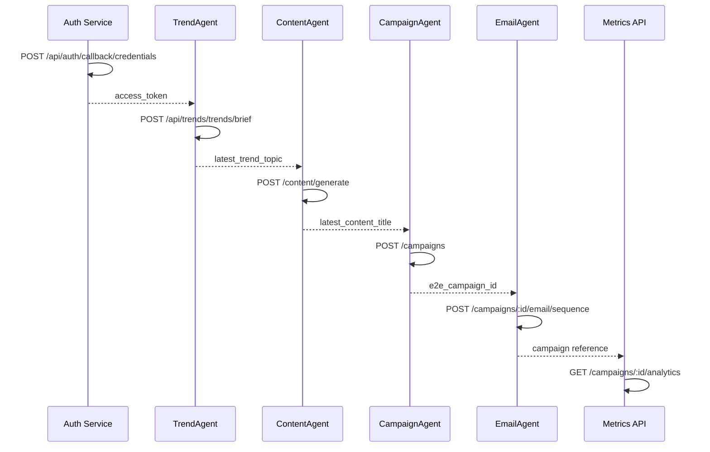

# NeonHub API Testing Strategy – Postman + Newman

## API Discovery

### Base Configuration
- **Base URL (Local)**: `http://localhost:3001/api`
- **Port**: `3001`
- **Protocol**: HTTP (local), HTTPS (staging/prod)
- **Auth**: Bearer Token (JWT in Authorization header)

### Key Endpoints by Domain

#### Health & System
- GET `/health` – System status
- GET `/readyz` – Readiness check

#### Auth & Users
- POST `/auth/login` – Get access token
- GET `/auth/me` – User profile
- POST `/auth/logout` – Logout

#### Campaigns (Core)
- POST/GET/PUT/DELETE `/campaigns` – CRUD
- POST `/campaigns/:id/schedule` – Schedule campaign
- POST `/campaigns/:id/ab-test` – A/B test
- GET `/campaigns/:id/analytics` – Metrics
- POST `/campaigns/:id/optimize` – AI optimize
- POST `/campaigns/:id/email/sequence` – Email sequence
- PATCH `/campaigns/:id/status` – Update status

#### Email Agent
- POST `/campaigns/email/optimize-subject` – Subject line AI
- POST `/campaigns/:id/email/sequence` – Email sequence

#### Social Agent
- POST `/campaigns/social/generate` – Generate copy
- POST `/campaigns/social/optimize` – Optimize copy
- POST `/campaigns/:id/social/schedule` – Schedule posts

#### SEO Agent
- GET `/seo` – Dashboard
- POST `/seo/audit` – Full audit
- GET `/seo/recommendations/weekly` – Recommendations
- POST `/seo/meta/generate-title` – Title generation
- POST `/seo/keywords/classify-intent` – Keyword classification
- POST `/seo/content/analyze` – Content analysis

#### Connectors
- GET `/connectors` – Inventory connectors
- POST `/connectors/:name/api-key` – Store API credentials
- DELETE `/connectors/:name/auth/:id` – Revoke credentials

#### Jobs & Queues
- GET/POST `/jobs` – Job management
- GET `/jobs/:id` – Job status

#### Billing & Finance
- GET `/billing/plan` – Current plan metadata
- GET `/billing/usage` – Usage breakdown
- POST `/billing/checkout` – Stripe checkout session
- POST `/billing/portal` – Billing portal link (return URL)

#### Tasks & Workflow
- POST/GET/PUT/DELETE `/tasks` – Task lifecycle
- PUT `/tasks/:id` – Status transitions (todo → done, etc.)

#### Team & Access
- GET `/team/members` – Member roster + filters
- POST `/team/invite` – Invite by email
- DELETE `/team/invitations/:id` – Revoke invite
- GET `/team/invitations` – Pending invites

#### Data Trust & Governance
- POST `/governance/ethics/assess` – Ethics/guardrail review
- POST `/governance/evaluate` – Policy evaluation
- GET `/governance/audit-logs` – Audit trail
- POST `/data-trust/audit/log` – Custom audit event
- GET `/data-trust/audit/logs` – Audit log list

#### Analytics
- GET `/metrics` – Prometheus scrape
- POST `/metrics/events` – Custom event tracking
- GET `/trends` – Aggregated trend brief
- POST `/trends/brief` – TrendAgent run

#### Settings & Credentials
- GET/PUT `/settings` – User settings
- PUT `/settings/notifications` – Notification preferences
- GET/POST/DELETE `/credentials` – Store credentials

#### Keywords & Personas
- GET/POST/PUT/DELETE `/keywords` – Keyword CRUD
- GET/POST/PUT/DELETE `/personas` – Persona CRUD

#### Editorial Calendar
- GET/POST/PUT/DELETE `/editorial-calendar` – Content calendar

#### Governance & Compliance
- POST `/governance/evaluate` – Ethics review
- GET `/governance/audit-logs` – Audit trail

#### SMS & Social
- POST `/sms/send` – Send transactional SMS
- POST `/sms/inbound` – Simulate Twilio webhook
- POST `/social/:platform/dm` – DM automation
- POST `/campaigns/:id/social/schedule` – Schedule posts

#### Site Assets
- GET `/sitemap.xml` – XML sitemap
- POST `/sitemap/invalidate` – Cache purge
- GET `/robots.txt` – Robots manifest

---

## Golden E2E Flows

### Flow 1: Email Campaign Launch
1. Login → Get token
2. Create campaign → Get campaign_id
3. Generate email via agent
4. Enqueue email send → Get job_id
5. Poll job status
6. Fetch analytics

### Flow 2: SEO Audit & Optimization
1. Login → Get token
2. Run SEO audit
3. Fetch recommendations
4. Generate optimized metadata
5. Analyze content

### Flow 3: Social Campaign
1. Login → Get token
2. Create campaign
3. Generate social copy
4. Schedule posts
5. Check engagement metrics

### Flow 4: Multi-Agent Trend → Content → Campaign
1. Login → Get token (isolated from Flow 1 credentials)
2. TrendAgent brief → Store `latest_trend_topic`
3. ContentAgent generate article → Store `latest_content_title`
4. CampaignAgent create campaign → Store `e2e_campaign_id`
5. EmailAgent generate sequence
6. Fetch campaign analytics to validate metrics field coverage



---

## Postman Environment Variables

```
base_url: http://localhost:3001/api
auth_base_url: http://localhost:3000
email: test@neonhub.local
password: TestPassword123!
access_token: (filled by login)
campaign_id: (filled by campaign creation)
e2e_campaign_id: (created via Flow 4)
job_id: (filled by job enqueue)
task_id: (filled by tasks suite)
team_invitation_id: (filled by invites)
keyword_id: (filled by keyword creation)
persona_id: (filled by persona creation)
connector_id: (filled by connector creation)
connector_slug: hubspot (default)
connector_auth_id: (set when deleting)
campaign_start_date / campaign_end_date / campaign_social_date: ISO timestamps
billing_success_url / billing_cancel_url / billing_return_url: Callback URLs
sms_person_id / sms_brand_id: Seed IDs for messaging
latest_trend_topic / latest_content_title: Set by multi-agent flow
```

---

## Implementation Checklist

- [x] Create Postman collection JSON
- [x] Create environment files (Local, Staging)
- [x] Implement auth login flow
- [x] Populate priority domain requests (Campaigns, Billing, Tasks, Team, Governance, SMS, Metrics, Sitemaps)
- [x] Add happy path tests + response-time guards
- [x] Add sad path tests (invalid payloads + auth)
- [x] Build E2E flows (Golden + Multi-Agent)
- [ ] Test locally with Newman (documented command; run blocked without API instance)
- [x] Add Newman to package.json
- [ ] Wire CI/CD integration (pending GitHub workflow update)
- [x] Document in README / plan

---

## Next Steps
1. Expand coverage to remaining domains (Documents, Eco-metrics, Predictive, Messages, TRPC endpoints).
2. Implement connector auth lifecycle tests once fixture data is available.
3. Run `pnpm test:api:newman` against a seeded API + capture baseline artifacts.
4. Wire CI workflow to execute Newman + report artifacts (see Step 7 plan).
