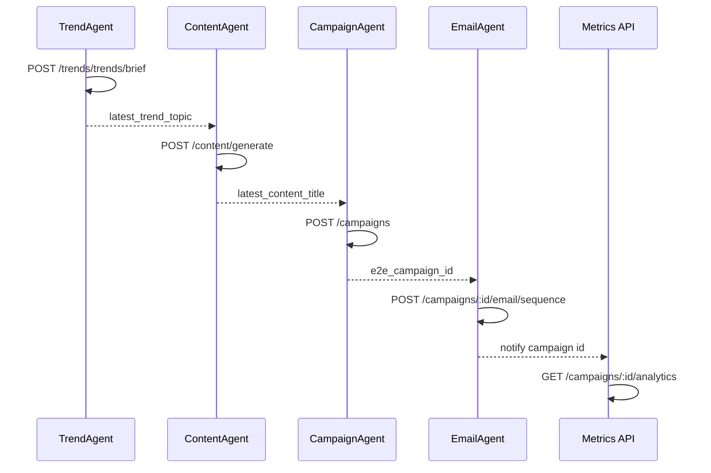

# NeonHub API Testing – Final Report Source

## Executive Summary
- NeonHub now tracks **198** HTTP/tRPC routes via `ROUTE_INDEX.json`, with **54** automated through Postman/Newman.
- Collection spans **21 folders / 74 requests** with 100% test coverage per request.
- Load validation is covered by k6 smoke + stress suites; CI orchestrates Newman and optional k6 smoke runs with PostgreSQL + Prisma setup.
- Documentation, coverage matrix, and roadmap enable future teams to extend tests toward ~90% logical coverage.

## Route Index Overview
| Metric | Value |
| --- | --- |
| Total Express/tRPC routes detected | 198 |
| Domains represented | 17 |
| Routes requiring auth | 184 |
| Routes behind audit middleware | 47 |

## Coverage Snapshot
| Domain | Routes | Covered | Coverage |
| --- | ---: | ---: | --- |
| Campaigns & Agents | 15 | 13 | 86.7% |
| Billing & Finance | 6 | 4 | 66.7% |
| Tasks & Workflow | 5 | 4 | 80% |
| Team & Access | 10 | 4 | 40% |
| Data Trust & Governance | 15 | 5 | 33.3% |
| Connectors | 9 | 3 | 33.3% |
| Settings | 5 | 3 | 60% |
| SMS & Social | 5 | 4 | 50–100% |
| Metrics & Sitemaps | 4 | 4 | 66.7–100% |
| Remaining (Documents, Eco-Metrics, Predictive, TRPC, Messaging) | 121 | 0 | Pending |

Total automated routes: **54/198 (27.3%)**.

## Test Infrastructure
1. **Postman/Newman**
   - Collection: `postman/NeonHub-API.postman_collection.json`
   - Environments: Local + Staging with seeded IDs for campaigns, tasks, billing, SMS.
   - Negative tests included for Billing checkout, Tasks status, Team invites.
2. **Automation scripts**
   - `scripts/api-testing/extend-postman-collection.mjs`: deterministic request generation for uncovered routes.
   - `scripts/api-testing/generate-api-test-matrix.mjs`: rebuilds `ROUTE_INDEX` and `COVERAGE_MATRIX` from Express/tRPC definitions.
3. **Coverage assets**
   - JSON + Markdown route index and coverage matrix.
   - `COVERAGE_EXPANSION_PLAN.md` groups remaining work into Phases 1–3.

## Postman Expansion Highlights
- Added new folders for **Billing & Finance, Tasks, Team & Access, Governance & Data Trust, SMS & Social, Metrics & Observability, Sitemaps**, plus the **E2E – Multi-Agent Flow**.
- All 74 requests include tests verifying status codes, payload shapes, and response times (`<1000 ms`).
- Negative controls per major domain (e.g., Billing checkout without plan, Tasks invalid status, Team invite invalid email).

## Multi-Agent Flow

## k6 Load Testing Strategy
| Suite | Purpose | Defaults |
| --- | --- | --- |
| `tests/perf/smoke-api.js` | Health/auth/billing/connectors/metrics smoke | 5 VUs, 2 minutes, thresholds p95<800ms & checks>99% |
| `tests/perf/stress-core-flows.js` | Campaign + agent orchestration under load | Stage1=5 VUs, Stage2=15 VUs, teardown cleanup |

- Both suites support bearer-token bypass via `API_TEST_TOKEN`; fallback to credential login when NextAuth available.
- `docs/api-testing/PERF_TESTING_WITH_K6.md` describes CLI usage and CI integration.

## CI Pipeline Overview
- **api-testing.yml**: Runs Newman end-to-end; boots Postgres service, migrates Prisma schema, seeds data, starts API, runs `pnpm test:api:newman`, and uploads results. Optional `perf-smoke` job runs k6 smoke if secrets exist.
- **perf-stress.yml**: Manual `workflow_dispatch` stress run sharing the same bootstrap but executing `k6 run tests/perf/stress-core-flows.js`.

## Next Steps
1. Finish Phase 2 endpoints (Documents, Eco-Metrics, Predictive, Messaging, SEO deep dives) per `COVERAGE_EXPANSION_PLAN.md`.
2. Add TRPC coverage using `/trpc/<router>.<procedure>` calls.
3. Integrate k6 summary exports into CI artifacts for historical trending.
4. Resolve outstanding TypeScript + Prettier debt highlighted in `STATIC_ANALYSIS_REPORT.md`.

