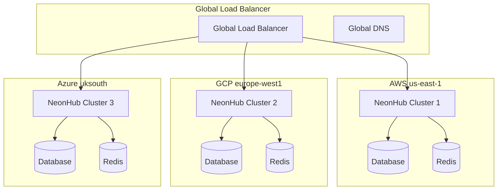
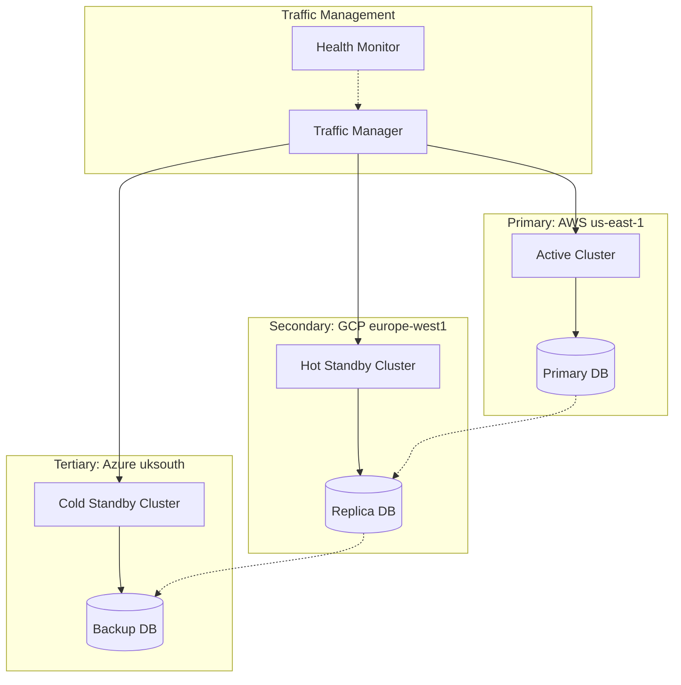
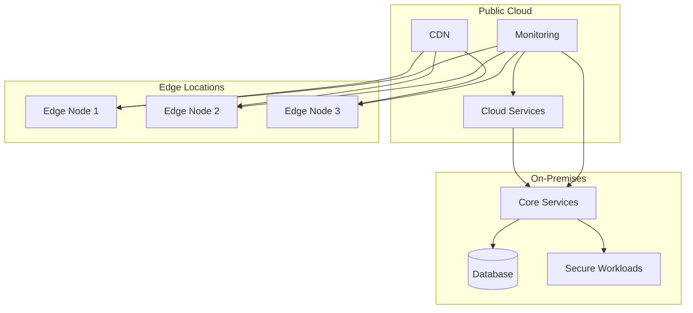

# Multi-Cloud Deployment Strategies

## Overview

NeonHub v4.0 supports comprehensive multi-cloud deployment strategies, enabling seamless operation across AWS, Google Cloud Platform (GCP), Microsoft Azure, and on-premises infrastructure. This guide covers deployment patterns, cost optimization, and operational best practices.

## Supported Cloud Providers

### Amazon Web Services (AWS)
- **Regions**: 25+ global regions
- **Services**: EKS, ECS, Lambda, S3, CloudFront
- **Integration**: Native Kubernetes support, IAM roles

### Google Cloud Platform (GCP)
- **Regions**: 35+ global regions
- **Services**: GKE, Cloud Run, Cloud Storage, Cloud CDN
- **Integration**: Anthos for multi-cloud management

### Microsoft Azure
- **Regions**: 60+ global regions
- **Services**: AKS, Container Instances, Blob Storage, Front Door
- **Integration**: Azure Arc for hybrid management

### On-Premises
- **Infrastructure**: VMware, OpenStack, bare metal
- **Integration**: Kubernetes-compatible orchestration

## Deployment Patterns

### 1. Active-Active Multi-Cloud



**Characteristics:**
- All regions actively serve traffic
- Geographic load distribution
- High availability and fault tolerance
- Complex data synchronization

**Use Cases:**
- Global applications with worldwide users
- Regulatory compliance requiring data residency
- Disaster recovery with zero RTO

### 2. Active-Passive with Hot Standby



**Characteristics:**
- Primary region handles all traffic
- Secondary regions ready for immediate failover
- Cost-effective compared to active-active
- Simpler data management

**Use Cases:**
- Cost-sensitive applications
- Applications with predictable traffic patterns
- Regulatory environments with primary jurisdiction

### 3. Hybrid Cloud Deployment



**Characteristics:**
- Sensitive data remains on-premises
- Public cloud for burst capacity and CDN
- Edge computing for low-latency services
- Complex networking and security

**Use Cases:**
- Highly regulated industries (finance, healthcare)
- Data sovereignty requirements
- Legacy system integration

## Infrastructure as Code

### Terraform Multi-Cloud Setup

```hcl
# main.tf
terraform {
  required_providers {
    aws = {
      source  = "hashicorp/aws"
      version = "~> 4.0"
    }
    google = {
      source  = "hashicorp/google"
      version = "~> 4.0"
    }
    azurerm = {
      source  = "hashicorp/azurerm"
      version = "~> 3.0"
    }
  }
}

# AWS Provider
provider "aws" {
  region = var.aws_region
}

# GCP Provider
provider "google" {
  project = var.gcp_project
  region  = var.gcp_region
}

# Azure Provider
provider "azurerm" {
  features {}
}

# NeonHub Cluster Module
module "neonhub_cluster" {
  source = "./modules/neonhub-cluster"

  providers = {
    aws     = aws
    google  = google
    azurerm = azurerm
  }

  cluster_name    = "neonhub-global"
  environment     = "production"
  node_count      = 3
  instance_type   = "t3.large"

  multi_cloud_config = {
    enable_cross_cloud = true
    primary_provider   = "aws"
    backup_providers   = ["google", "azurerm"]
  }
}
```

### Kubernetes Multi-Cloud Configuration

```yaml
# multi-cloud-config.yaml
apiVersion: v1
kind: ConfigMap
metadata:
  name: neonhub-multi-cloud-config
  namespace: neonhub
data:
  config.yaml: |
    multiCloud:
      enabled: true
      providers:
        aws:
          enabled: true
          region: us-east-1
          cluster: neonhub-aws
          services:
            - database
            - cache
            - storage
        gcp:
          enabled: true
          region: europe-west1
          cluster: neonhub-gcp
          services:
            - compute
            - monitoring
        azure:
          enabled: true
          region: uksouth
          cluster: neonhub-azure
          services:
            - networking
            - security

      loadBalancing:
        strategy: latency-based
        healthChecks:
          interval: 30s
          timeout: 5s
          unhealthyThreshold: 3

      dataReplication:
        mode: active-active
        consistency: eventual
        conflictResolution: timestamp
```

## Cost Optimization Strategies

### 1. Spot Instances and Preemptible VMs

```yaml
# AWS Spot Instance Configuration
apiVersion: karpenter.sh/v1alpha5
kind: Provisioner
metadata:
  name: neonhub-spot
spec:
  requirements:
    - key: karpenter.sh/capacity-type
      operator: In
      values: ["spot"]
    - key: node.kubernetes.io/instance-type
      operator: In
      values: ["t3.large", "t3.xlarge", "m5.large"]
  limits:
    resources:
      cpu: "1000"
      memory: 1000Gi
  provider:
    instanceProfile: KarpenterInstanceProfile-neonhub
    subnetSelector:
      karpenter.sh/discovery: neonhub
    securityGroupSelector:
      karpenter.sh/discovery: neonhub
```

### 2. Auto-Scaling Based on Cost

```typescript
// Cost-aware scaling configuration
const costAwareScaling = {
  policies: [
    {
      name: "cost-optimization",
      metric: "AWS/EC2 CPUUtilization",
      targetValue: 70,
      scaleInCooldown: 300,
      scaleOutCooldown: 60,
      spotInstancePreference: 0.8,
      onDemandFallback: true
    }
  ],
  schedules: [
    {
      name: "off-peak-discount",
      cron: "0 2 * * *", // 2 AM daily
      minCapacity: 2,
      maxCapacity: 10,
      instanceType: "spot"
    }
  ]
};
```

### 3. Data Transfer Cost Optimization

```yaml
# CloudFront Distribution for Global CDN
apiVersion: cloudfront.aws.upbound.io/v1beta1
kind: Distribution
metadata:
  name: neonhub-global-cdn
spec:
  forProvider:
    enabled: true
    defaultCacheBehavior:
      targetOriginId: neonhub-origin
      viewerProtocolPolicy: redirect-to-https
      allowedMethods:
        - GET
        - HEAD
        - OPTIONS
        - PUT
        - POST
        - PATCH
        - DELETE
      cachedMethods:
        - GET
        - HEAD
        - OPTIONS
    origins:
      - domainName: api.neonhub.ai
        originId: neonhub-origin
        customOriginConfig:
          httpPort: 80
          httpsPort: 443
          originProtocolPolicy: https-only
    priceClass: PriceClass_100 # Use only US, Canada, Europe
```

## Networking and Security

### Global Load Balancing

```yaml
# AWS Global Accelerator Configuration
apiVersion: globalaccelerator.aws.upbound.io/v1beta1
kind: Accelerator
metadata:
  name: neonhub-global-accelerator
spec:
  forProvider:
    enabled: true
    ipAddressType: IPV4
```

### Cross-Cloud Security Groups

```hcl
# Security Groups for Multi-Cloud Access
resource "aws_security_group" "neonhub_cross_cloud" {
  name_prefix = "neonhub-cross-cloud-"

  ingress {
    from_port   = 443
    to_port     = 443
    protocol    = "tcp"
    cidr_blocks = [
      "10.0.0.0/8",    # AWS VPC
      "172.16.0.0/12", # GCP VPC
      "192.168.0.0/16" # Azure VNet
    ]
  }

  ingress {
    from_port = 8080
    to_port   = 8080
    protocol  = "tcp"
    cidr_blocks = [
      "10.0.0.0/8",
      "172.16.0.0/12",
      "192.168.0.0/16"
    ]
  }
}
```

### VPN and Direct Connect

```yaml
# AWS VPN Connection
apiVersion: ec2.aws.upbound.io/v1beta1
kind: VpnConnection
metadata:
  name: neonhub-to-gcp-vpn
spec:
  forProvider:
    type: ipsec.1
    customerGatewayId: cg-gcp-gateway
    vpnGatewayId: vgw-aws-gateway
    staticRoutesOnly: true
```

## Monitoring and Observability

### Multi-Cloud Monitoring Dashboard

```json
{
  "dashboard": {
    "title": "Multi-Cloud Operations",
    "panels": [
      {
        "title": "Global Latency",
        "type": "graph",
        "targets": [
          {
            "expr": "histogram_quantile(0.95, rate(http_request_duration_seconds_bucket{region=~\".+\"}[5m]))",
            "legendFormat": "{{region}}"
          }
        ]
      },
      {
        "title": "Cross-Cloud Traffic",
        "type": "graph",
        "targets": [
          {
            "expr": "rate(aws_natgateway_bytes_out_sum[5m]) + rate(gcp_nat_bytes_out[5m])",
            "legendFormat": "Data Transfer Cost"
          }
        ]
      },
      {
        "title": "Provider Costs",
        "type": "table",
        "targets": [
          {
            "expr": "aws_billing_estimated_charges + gcp_billing_total + azure_consumption",
            "legendFormat": "{{provider}}"
          }
        ]
      }
    ]
  }
}
```

### Alerting Configuration

```yaml
# Multi-Cloud Alerting Rules
groups:
  - name: multi-cloud-alerts
    rules:
      - alert: CrossCloudLatencyHigh
        expr: histogram_quantile(0.95, rate(http_request_duration_seconds_bucket[5m])) > 2
        for: 5m
        labels:
          severity: warning
        annotations:
          summary: "High latency detected across clouds"
          description: "95th percentile latency > 2s for 5 minutes"

      - alert: CloudProviderFailure
        expr: up{provider=~".+"} == 0
        for: 2m
        labels:
          severity: critical
        annotations:
          summary: "Cloud provider failure detected"
          description: "{{$labels.provider}} services are down"

      - alert: CostAnomaly
        expr: rate(aws_billing_estimated_charges[1h]) > rate(aws_billing_estimated_charges[24h]) * 2
        for: 15m
        labels:
          severity: warning
        annotations:
          summary: "Cost anomaly detected"
          description: "AWS costs increased by >200% in the last hour"
```

## Disaster Recovery

### Cross-Cloud Backup Strategy

```yaml
# Cross-Cloud Backup Configuration
apiVersion: v1
kind: ConfigMap
metadata:
  name: neonhub-backup-config
data:
  backup.yaml: |
    schedules:
      - name: daily-backup
        schedule: "0 2 * * *"
        providers:
          - aws:
              bucket: neonhub-backups-us-east-1
              region: us-east-1
          - gcp:
              bucket: neonhub-backups-europe-west1
              region: europe-west1
          - azure:
              container: neonhub-backups
              account: neonhubbackupstorage

    retention:
      daily: 30
      weekly: 12
      monthly: 36

    encryption:
      enabled: true
      kmsKey: alias/neonhub-backup-key
```

### Failover Procedures

```bash
#!/bin/bash
# Multi-Cloud Failover Script

PRIMARY_CLOUD="aws"
SECONDARY_CLOUD="gcp"
TERTIARY_CLOUD="azure"

# Check primary cloud health
if ! check_cloud_health "$PRIMARY_CLOUD"; then
    echo "Primary cloud failure detected. Initiating failover..."

    # Promote secondary to primary
    promote_to_primary "$SECONDARY_CLOUD"

    # Update DNS and load balancers
    update_global_dns "$SECONDARY_CLOUD"
    update_load_balancers "$SECONDARY_CLOUD"

    # Start tertiary as new secondary
    setup_as_secondary "$TERTIARY_CLOUD"

    # Notify stakeholders
    send_alert "Failover completed: $SECONDARY_CLOUD is now primary"

    # Start recovery of primary
    initiate_recovery "$PRIMARY_CLOUD"
fi
```

## Performance Optimization

### Global Traffic Management

```typescript
// Intelligent traffic routing
const trafficManager = {
  routingRules: [
    {
      name: "latency-based-routing",
      conditions: [
        { metric: "latency", operator: "<", value: 100 },
        { metric: "errorRate", operator: "<", value: 0.01 }
      ],
      action: "route_to_nearest"
    },
    {
      name: "cost-based-routing",
      conditions: [
        { metric: "currentCost", operator: ">", value: "budgetThreshold" }
      ],
      action: "route_to_cheapest"
    },
    {
      name: "compliance-routing",
      conditions: [
        { metric: "dataResidency", operator: "equals", value: "required" }
      ],
      action: "route_to_compliant_region"
    }
  ]
};
```

### Resource Optimization

```yaml
# Karpenter Configuration for Multi-Cloud
apiVersion: karpenter.sh/v1alpha5
kind: Provisioner
metadata:
  name: multi-cloud-optimizer
spec:
  requirements:
    - key: topology.kubernetes.io/zone
      operator: In
      values: ["us-east-1a", "europe-west1-b", "uksouth-1"]
    - key: karpenter.sh/capacity-type
      operator: In
      values: ["on-demand", "spot"]
  limits:
    resources:
      cpu: "1000"
      memory: 2000Gi
  provider:
    # Multi-cloud provider configuration
    multiCloud:
      enabled: true
      costOptimization: true
      performancePriority: "balanced"
```

## Compliance and Governance

### Multi-Cloud Compliance Matrix

| Requirement | AWS | GCP | Azure | On-Prem |
|-------------|-----|-----|-------|---------|
| GDPR | ✓ | ✓ | ✓ | ✓ |
| CCPA | ✓ | ✓ | ✓ | ✓ |
| HIPAA | ✓ | ✓ | ✓ | ✓ |
| SOC 2 | ✓ | ✓ | ✓ | ✓ |
| ISO 27001 | ✓ | ✓ | ✓ | ✓ |

### Data Residency Controls

```typescript
// Data residency enforcement
const dataResidencyRules = {
  gdpr: {
    regions: ["eu-west-1", "eu-central-1", "europe-west1", "uksouth"],
    encryption: "AES-256",
    retention: "7 years"
  },
  ccpa: {
    regions: ["us-west-2", "us-east-1", "us-central1"],
    encryption: "AES-256-GCM",
    retention: "3 years"
  },
  hipaa: {
    regions: ["us-east-1", "us-east-2"],
    encryption: "AES-256",
    auditLogging: true
  }
};
```

## Migration Strategies

### From Single Cloud to Multi-Cloud

1. **Assessment Phase**
   - Current infrastructure evaluation
   - Cost-benefit analysis
   - Risk assessment

2. **Planning Phase**
   - Target architecture design
   - Migration timeline creation
   - Resource allocation

3. **Implementation Phase**
   - Secondary cloud setup
   - Data migration
   - Testing and validation

4. **Optimization Phase**
   - Performance tuning
   - Cost optimization
   - Monitoring enhancement

### Tools and Automation

```bash
# Multi-Cloud Migration Script
#!/bin/bash

# Setup secondary cloud
terraform apply -target=module.secondary_cloud

# Configure data replication
kubectl apply -f data-replication.yaml

# Setup load balancer
kubectl apply -f global-load-balancer.yaml

# Enable traffic shifting
kubectl apply -f traffic-splitting.yaml

# Monitor migration progress
watch kubectl get pods -l app=neonhub
```

## Best Practices

### Operational Excellence
1. **Standardized Deployments**: Use infrastructure as code for consistency
2. **Automated Testing**: Comprehensive testing across all cloud providers
3. **Monitoring Coverage**: End-to-end observability across clouds
4. **Incident Response**: Multi-cloud incident management procedures

### Security
1. **Unified Identity**: Single sign-on across cloud providers
2. **Consistent Policies**: Uniform security policies and controls
3. **Regular Audits**: Automated compliance scanning and reporting
4. **Zero-Trust**: Identity verification for all cross-cloud communications

### Cost Management
1. **Budget Alerts**: Automated cost monitoring and alerting
2. **Resource Optimization**: Right-sizing and auto-scaling
3. **Reserved Instances**: Long-term commitments for cost savings
4. **Usage Analytics**: Detailed cost analysis and optimization recommendations

## Support and Resources

- **AWS Multi-Cloud**: [aws.amazon.com/multicloud](https://aws.amazon.com/multicloud)
- **GCP Anthos**: [cloud.google.com/anthos](https://cloud.google.com/anthos)
- **Azure Arc**: [azure.microsoft.com/en-us/services/azure-arc](https://azure.microsoft.com/en-us/services/azure-arc)
- **Terraform Registry**: [registry.terraform.io](https://registry.terraform.io)
- **Kubernetes Multi-Cloud**: [kubernetes.io/docs/concepts/cluster-administration](https://kubernetes.io/docs/concepts/cluster-administration)