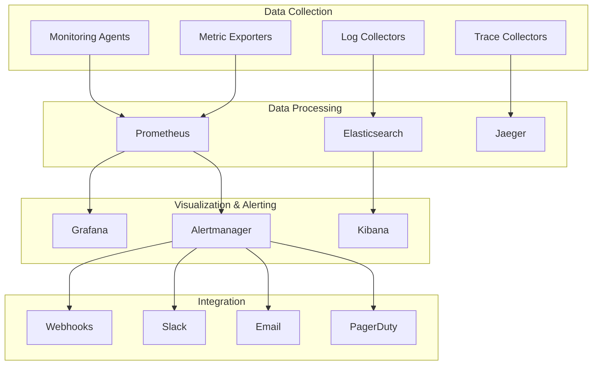

# Monitoring and Alerting Configuration Guide

## Overview

This guide provides comprehensive instructions for configuring monitoring and alerting systems for NeonHub v4.0's federated intelligence ecosystem. Proper monitoring ensures operational visibility, performance optimization, and rapid incident response.

## Monitoring Architecture



## Core Monitoring Components

### Prometheus Configuration

#### Federation Metrics Collection
```yaml
# prometheus.yml
global:
  scrape_interval: 15s
  evaluation_interval: 15s

rule_files:
  - "alert_rules.yml"
  - "recording_rules.yml"

alerting:
  alertmanagers:
    - static_configs:
        - targets:
          - alertmanager:9093

scrape_configs:
  - job_name: 'federation-manager'
    static_configs:
      - targets: ['federation-manager:9090']
    metrics_path: '/metrics'
    scrape_interval: 5s
    scrape_timeout: 5s

  - job_name: 'federation-nodes'
    static_configs:
      - targets:
        - 'node-1:9090'
        - 'node-2:9090'
        - 'node-3:9090'
    metrics_path: '/metrics'
    scrape_interval: 10s
    relabel_configs:
      - source_labels: [__address__]
        target_label: node_id
        regex: '([^:]+):.*'
        replacement: '${1}'

  - job_name: 'aix-protocol'
    static_configs:
      - targets: ['aix-coordinator:9090']
    metrics_path: '/metrics'
    scrape_interval: 5s

  - job_name: 'compliance-monitor'
    static_configs:
      - targets: ['compliance-manager:9090']
    metrics_path: '/metrics'
    scrape_interval: 30s
```

#### Custom Metrics
```typescript
// Custom federation metrics
const federationMetrics = {
  // Node health metrics
  federation_node_status: new Gauge({
    name: 'federation_node_status',
    help: 'Federation node status (1=healthy, 0=unhealthy)',
    labelNames: ['node_id', 'region']
  }),

  // Message throughput
  federation_messages_total: new Counter({
    name: 'federation_messages_total',
    help: 'Total number of federation messages',
    labelNames: ['message_type', 'direction']
  }),

  // Latency metrics
  federation_message_latency: new Histogram({
    name: 'federation_message_latency',
    help: 'Federation message latency in seconds',
    labelNames: ['message_type'],
    buckets: [0.1, 0.5, 1, 2.5, 5, 10]
  }),

  // Connection pool metrics
  federation_connections_active: new Gauge({
    name: 'federation_connections_active',
    help: 'Number of active federation connections',
    labelNames: ['node_id']
  }),

  // Privacy budget metrics
  federation_privacy_budget_used: new Gauge({
    name: 'federation_privacy_budget_used',
    help: 'Privacy budget used in federated learning',
    labelNames: ['round_id', 'participant_id']
  }),

  // Compliance metrics
  compliance_violations_total: new Counter({
    name: 'compliance_violations_total',
    help: 'Total number of compliance violations',
    labelNames: ['violation_type', 'severity']
  })
};
```

### Alert Rules Configuration

#### Federation Alerts
```yaml
# alert_rules.yml
groups:
  - name: federation.alerts
    rules:
      - alert: FederationNodeDown
        expr: federation_node_status == 0
        for: 2m
        labels:
          severity: critical
          service: federation
        annotations:
          summary: "Federation node {{ $labels.node_id }} is down"
          description: "Federation node {{ $labels.node_id }} in region {{ $labels.region }} has been down for 2 minutes"

      - alert: FederationHighLatency
        expr: histogram_quantile(0.95, rate(federation_message_latency_bucket[5m])) > 2
        for: 5m
        labels:
          severity: warning
          service: federation
        annotations:
          summary: "High federation message latency"
          description: "95th percentile message latency > 2s for 5 minutes"

      - alert: FederationLowThroughput
        expr: rate(federation_messages_total[5m]) < 10
        for: 10m
        labels:
          severity: warning
          service: federation
        annotations:
          summary: "Low federation message throughput"
          description: "Message throughput < 10 msg/s for 10 minutes"

      - alert: FederationConnectionPoolExhausted
        expr: federation_connections_active / federation_connections_max > 0.9
        for: 5m
        labels:
          severity: warning
          service: federation
        annotations:
          summary: "Federation connection pool nearly exhausted"
          description: "Connection pool utilization > 90% for 5 minutes on node {{ $labels.node_id }}"
```

#### AIX Protocol Alerts
```yaml
  - name: aix.alerts
    rules:
      - alert: AIXLearningRoundFailed
        expr: aix_learning_round_status == 0
        for: 5m
        labels:
          severity: warning
          service: aix
        annotations:
          summary: "AIX learning round failed"
          description: "Federated learning round {{ $labels.round_id }} failed"

      - alert: AIXPrivacyBudgetExceeded
        expr: federation_privacy_budget_used > 1
        for: 1m
        labels:
          severity: critical
          service: aix
        annotations:
          summary: "Privacy budget exceeded"
          description: "Privacy budget exceeded for participant {{ $labels.participant_id }} in round {{ $labels.round_id }}"

      - alert: AIXModelCompressionFailed
        expr: aix_compression_failures_total > 0
        for: 1m
        labels:
          severity: warning
          service: aix
        annotations:
          summary: "Model compression failed"
          description: "Model compression failed {{ $value }} times in the last minute"
```

#### Compliance Alerts
```yaml
  - name: compliance.alerts
    rules:
      - alert: ComplianceViolationDetected
        expr: increase(compliance_violations_total[5m]) > 0
        labels:
          severity: critical
          service: compliance
        annotations:
          summary: "Compliance violation detected"
          description: "{{ $labels.violation_type }} violation of severity {{ $labels.severity }} detected"

      - alert: GDPRDSARTimeout
        expr: gdpr_dsar_processing_time > 2592000
        for: 1m
        labels:
          severity: critical
          service: compliance
        annotations:
          summary: "GDPR DSAR timeout"
          description: "DSAR request {{ $labels.request_id }} exceeded 30-day processing limit"

      - alert: CrossBorderTransferBlocked
        expr: cross_border_transfer_status == 0
        for: 5m
        labels:
          severity: warning
          service: compliance
        annotations:
          summary: "Cross-border transfer blocked"
          description: "Transfer {{ $labels.transfer_id }} blocked due to compliance requirements"
```

## Grafana Dashboard Configuration

### Federation Overview Dashboard

```json
{
  "dashboard": {
    "title": "Federation Overview",
    "tags": ["federation", "neonhub"],
    "panels": [
      {
        "title": "Federation Health Status",
        "type": "stat",
        "targets": [
          {
            "expr": "sum(federation_node_status)",
            "legendFormat": "Healthy Nodes"
          }
        ],
        "fieldConfig": {
          "defaults": {
            "color": {
              "mode": "thresholds"
            },
            "thresholds": {
              "mode": "absolute",
              "steps": [
                { "color": "red", "value": null },
                { "color": "orange", "value": 1 },
                { "color": "green", "value": 3 }
              ]
            }
          }
        }
      },
      {
        "title": "Message Throughput",
        "type": "graph",
        "targets": [
          {
            "expr": "rate(federation_messages_total[5m])",
            "legendFormat": "Messages/sec"
          }
        ]
      },
      {
        "title": "Message Latency",
        "type": "graph",
        "targets": [
          {
            "expr": "histogram_quantile(0.95, rate(federation_message_latency_bucket[5m]))",
            "legendFormat": "95th percentile"
          },
          {
            "expr": "histogram_quantile(0.50, rate(federation_message_latency_bucket[5m]))",
            "legendFormat": "50th percentile"
          }
        ]
      },
      {
        "title": "Connection Pool Usage",
        "type": "bargauge",
        "targets": [
          {
            "expr": "federation_connections_active / federation_connections_max",
            "legendFormat": "{{ node_id }}"
          }
        ]
      }
    ]
  }
}
```

### AIX Protocol Dashboard

```json
{
  "dashboard": {
    "title": "AIX Protocol Monitoring",
    "panels": [
      {
        "title": "Active Learning Rounds",
        "type": "stat",
        "targets": [
          {
            "expr": "aix_learning_rounds_active",
            "legendFormat": "Active Rounds"
          }
        ]
      },
      {
        "title": "Model Compression Ratio",
        "type": "graph",
        "targets": [
          {
            "expr": "aix_compression_ratio",
            "legendFormat": "Compression Ratio"
          }
        ]
      },
      {
        "title": "Privacy Budget Usage",
        "type": "heatmap",
        "targets": [
          {
            "expr": "federation_privacy_budget_used",
            "legendFormat": "Privacy Budget"
          }
        ]
      },
      {
        "title": "Federated Learning Progress",
        "type": "table",
        "targets": [
          {
            "expr": "aix_learning_round_progress",
            "legendFormat": "Round Progress"
          }
        ]
      }
    ]
  }
}
```

## Alertmanager Configuration

### Alert Routing and Notification

```yaml
# alertmanager.yml
global:
  smtp_smarthost: 'smtp.gmail.com:587'
  smtp_from: 'alerts@neonhub.ai'
  smtp_auth_username: 'alerts@neonhub.ai'
  smtp_auth_password: 'your-smtp-password'

templates:
  - '/etc/alertmanager/templates/*.tmpl'

route:
  group_by: ['alertname', 'service']
  group_wait: 10s
  group_interval: 10s
  repeat_interval: 1h
  receiver: 'default'
  routes:
    - match:
        severity: critical
      receiver: 'critical-alerts'
    - match:
        service: federation
      receiver: 'federation-team'
    - match:
        service: compliance
      receiver: 'compliance-team'

receivers:
  - name: 'default'
    email_configs:
      - to: 'ops@neonhub.ai'
        subject: '{{ .GroupLabels.alertname }}'
        body: '{{ .CommonAnnotations.summary }}'

  - name: 'critical-alerts'
    pagerduty_configs:
      - service_key: 'your-pagerduty-service-key'
    slack_configs:
      - api_url: 'https://hooks.slack.com/services/YOUR/SLACK/WEBHOOK'
        channel: '#critical-alerts'
        title: '{{ .GroupLabels.alertname }}'
        text: '{{ .CommonAnnotations.description }}'

  - name: 'federation-team'
    slack_configs:
      - api_url: 'https://hooks.slack.com/services/YOUR/SLACK/WEBHOOK'
        channel: '#federation-alerts'
        title: '{{ .GroupLabels.alertname }}'
        text: '{{ .CommonAnnotations.description }}'

  - name: 'compliance-team'
    email_configs:
      - to: 'compliance@neonhub.ai'
        subject: 'Compliance Alert: {{ .GroupLabels.alertname }}'
        body: '{{ .CommonAnnotations.description }}'
    slack_configs:
      - api_url: 'https://hooks.slack.com/services/YOUR/SLACK/WEBHOOK'
        channel: '#compliance-alerts'
```

## Log Aggregation with ELK Stack

### Elasticsearch Configuration

```yaml
# elasticsearch.yml
cluster.name: neonhub-monitoring
node.name: monitoring-node-1
path.data: /var/lib/elasticsearch
path.logs: /var/log/elasticsearch
network.host: 0.0.0.0
http.port: 9200
discovery.type: single-node

xpack.security.enabled: true
xpack.security.transport.ssl.enabled: true
xpack.security.transport.ssl.verification_mode: certificate
xpack.security.transport.ssl.keystore.path: /usr/share/elasticsearch/config/certs/elastic-certificates.p12
xpack.security.transport.ssl.truststore.path: /usr/share/elasticsearch/config/certs/elastic-certificates.p12
```

### Logstash Pipeline Configuration

```ruby
# logstash.conf
input {
  beats {
    port => 5044
    ssl => true
    ssl_certificate => "/etc/logstash/certs/logstash.crt"
    ssl_key => "/etc/logstash/certs/logstash.key"
  }

  http {
    port => 8080
    codec => json
  }
}

filter {
  if [service] == "federation" {
    grok {
      match => { "message" => "%{TIMESTAMP_ISO8601:timestamp} %{LOGLEVEL:level} %{DATA:component} %{GREEDYDATA:message}" }
    }

    mutate {
      add_field => {
        "federation_node" => "%{component}"
        "log_type" => "federation"
      }
    }
  }

  if [service] == "aix" {
    grok {
      match => { "message" => "%{TIMESTAMP_ISO8601:timestamp} %{WORD:level} %{DATA:round_id} %{DATA:participant_id} %{GREEDYDATA:message}" }
    }

    mutate {
      add_field => {
        "aix_round" => "%{round_id}"
        "participant" => "%{participant_id}"
        "log_type" => "aix"
      }
    }
  }

  date {
    match => [ "timestamp", "ISO8601" ]
    target => "@timestamp"
  }
}

output {
  elasticsearch {
    hosts => ["elasticsearch:9200"]
    user => "logstash_writer"
    password => "${LOGSTASH_WRITER_PASSWORD}"
    index => "neonhub-%{+YYYY.MM.dd}"
    ssl => true
    cacert => "/etc/logstash/certs/ca.crt"
  }

  stdout {
    codec => rubydebug
  }
}
```

### Kibana Dashboard Configuration

```json
{
  "dashboard": {
    "title": "Federation Logs Overview",
    "panels": [
      {
        "title": "Log Volume by Service",
        "type": "pie",
        "query": {
          "match_all": {}
        },
        "aggs": {
          "service_split": {
            "terms": {
              "field": "service.keyword"
            }
          }
        }
      },
      {
        "title": "Error Logs Timeline",
        "type": "line",
        "query": {
          "term": {
            "level": "ERROR"
          }
        },
        "aggs": {
          "date_histogram": {
            "field": "@timestamp",
            "interval": "1h"
          }
        }
      },
      {
        "title": "Federation Node Errors",
        "type": "table",
        "query": {
          "bool": {
            "must": [
              { "term": { "service": "federation" } },
              { "term": { "level": "ERROR" } }
            ]
          }
        },
        "columns": [
          "@timestamp",
          "federation_node",
          "message"
        ]
      }
    ]
  }
}
```

## Distributed Tracing with Jaeger

### Jaeger Configuration

```yaml
# jaeger-config.yml
service:
  name: neonhub-tracing
  version: v4.0.0

reporter:
  queueSize: 100
  bufferFlushInterval: 10
  logSpans: false
  localAgentHostPort: jaeger-agent:6831

sampler:
  type: probabilistic
  param: 0.1

tags:
  service.name: neonhub
  service.version: v4.0.0
```

### Tracing Instrumentation

```typescript
// Federation tracing instrumentation
import { initTracer } from 'jaeger-client';

const tracer = initTracer({
  serviceName: 'federation-manager',
  sampler: {
    type: 'probabilistic',
    param: 0.1
  },
  reporter: {
    collector: {
      endpoint: 'http://jaeger-collector:14268/api/traces'
    }
  }
});

// Trace federation message processing
const span = tracer.startSpan('process_federation_message');
span.setTag('message.type', message.type);
span.setTag('message.id', message.id);

// ... message processing logic ...

span.finish();
```

## Custom Monitoring Agents

### Federation Health Agent

```typescript
// Federation health monitoring agent
class FederationHealthAgent {
  private prometheusRegistry: Registry;
  private healthChecks: Map<string, HealthCheck>;

  constructor() {
    this.prometheusRegistry = new Registry();
    this.healthChecks = new Map();

    // Register metrics
    this.prometheusRegistry.registerMetric(federation_node_status);
    this.prometheusRegistry.registerMetric(federation_connections_active);
  }

  async startMonitoring() {
    // Periodic health checks
    setInterval(async () => {
      for (const [nodeId, healthCheck] of this.healthChecks) {
        try {
          const isHealthy = await this.performHealthCheck(healthCheck);
          federation_node_status
            .labels({ node_id: nodeId, region: healthCheck.region })
            .set(isHealthy ? 1 : 0);
        } catch (error) {
          console.error(`Health check failed for ${nodeId}:`, error);
          federation_node_status
            .labels({ node_id: nodeId, region: healthCheck.region })
            .set(0);
        }
      }
    }, 30000); // Check every 30 seconds
  }

  private async performHealthCheck(healthCheck: HealthCheck): Promise<boolean> {
    try {
      const response = await fetch(`${healthCheck.endpoint}/health`, {
        timeout: healthCheck.timeout,
        headers: {
          'Authorization': `Bearer ${healthCheck.token}`
        }
      });

      return response.ok && (await response.json()).status === 'healthy';
    } catch (error) {
      return false;
    }
  }
}
```

## Alert Response Procedures

### Critical Alert Response

1. **Immediate Assessment**
   - Acknowledge alert within 5 minutes
   - Assess impact and scope
   - Determine if escalation is needed

2. **Investigation**
   - Check monitoring dashboards
   - Review recent logs and metrics
   - Identify root cause

3. **Response**
   - Execute predefined runbooks
   - Implement temporary mitigations
   - Coordinate with affected teams

4. **Resolution**
   - Apply permanent fixes
   - Update monitoring and alerting
   - Document incident and resolution

### Alert Escalation Matrix

```typescript
// Alert escalation configuration
const escalationMatrix = {
  critical: {
    immediate: ['oncall-engineer', 'engineering-manager'],
    '15_minutes': ['vp-engineering', 'ceo'],
    '1_hour': ['board-members']
  },
  warning: {
    '1_hour': ['team-lead'],
    '4_hours': ['engineering-manager'],
    '24_hours': ['vp-engineering']
  },
  info: {
    '24_hours': ['team-lead']
  }
};
```

## Performance Optimization

### Monitoring Performance Tuning

```yaml
# Prometheus performance tuning
global:
  scrape_interval: 15s
  evaluation_interval: 15s
  scrape_timeout: 10s

storage:
  tsdb:
    retention.time: 30d
    retention.size: 50GB

rule_files:
  - "optimized_rules.yml"

scrape_configs:
  # Use service discovery for dynamic scaling
  - job_name: 'federation-nodes'
    kubernetes_sd_configs:
      - role: pod
    relabel_configs:
      - source_labels: [__meta_kubernetes_pod_label_app]
        regex: federation-node
        action: keep
      - source_labels: [__meta_kubernetes_pod_name]
        target_label: pod_name
```

### Alert Optimization

```yaml
# Optimized alert rules with reduced noise
groups:
  - name: optimized.alerts
    rules:
      # Use for loops to reduce false positives
      - alert: FederationNodeDown
        expr: up{job="federation-nodes"} == 0
        for: 5m  # Increased from 2m
        labels:
          severity: critical
        annotations:
          summary: "Federation node {{ $labels.pod_name }} is down"
          description: "Federation node has been unreachable for 5 minutes"

      # Use rate limiting for noisy alerts
      - alert: HighErrorRate
        expr: rate(http_requests_total{status=~"5.."}[5m]) / rate(http_requests_total[5m]) > 0.1
        for: 10m  # Increased from 5m
        labels:
          severity: warning
```

## Integration with Third-Party Tools

### PagerDuty Integration

```yaml
# PagerDuty webhook configuration
integrations:
  - name: pagerduty
    type: webhook
    webhook_configs:
      - url: 'https://events.pagerduty.com/v2/enqueue'
        http_config:
          basic_auth:
            username: 'your-integration-key'
        send_resolved: true
```

### Slack Integration

```yaml
# Slack webhook configuration
integrations:
  - name: slack
    type: webhook
    webhook_configs:
      - url: 'https://hooks.slack.com/services/YOUR/SLACK/WEBHOOK'
        send_resolved: true
```

### Custom Webhook Integration

```typescript
// Custom webhook for internal systems
const customWebhook = {
  url: 'https://internal-alerts.neonhub.ai/webhook',
  http_config: {
    bearer_token: 'internal-webhook-token',
    tls_config: {
      ca_file: '/etc/ssl/certs/ca.pem'
    }
  },
  max_alerts: 10
};
```

This comprehensive monitoring and alerting configuration ensures complete observability and rapid response capabilities for NeonHub v4.0's federated intelligence ecosystem.