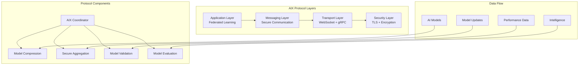

# AI Exchange (AIX) Protocol Documentation

## Overview

The AI Exchange (AIX) Protocol is the core communication framework for NeonHub v4.0's federated intelligence ecosystem. It enables secure, privacy-preserving exchange of AI models, intelligence, and collaborative learning across distributed federation nodes.

## Protocol Architecture



## Core Protocol Features

### 1. Privacy-Preserving Communication

#### Differential Privacy Integration
```typescript
// Differential privacy parameters for AIX
interface DifferentialPrivacyConfig {
  epsilon: number;  // Privacy budget parameter
  delta: number;    // Failure probability
  sensitivity: number;  // Query sensitivity
  mechanism: 'gaussian' | 'laplace';
  clipping: {
    enabled: boolean;
    threshold: number;
  };
}

// Privacy budget management
interface PrivacyBudgetManager {
  allocateBudget(participantId: string, queryType: string): Promise<number>;
  trackUsage(participantId: string, epsilon: number): Promise<void>;
  checkBudget(participantId: string): Promise<PrivacyBudgetStatus>;
}
```

#### Homomorphic Encryption
```typescript
// Homomorphic encryption for secure computation
interface HomomorphicEncryption {
  scheme: 'BFV' | 'CKKS' | 'BGV';
  keySize: number;
  polynomialDegree: number;
  ciphertextModulus: number;

  encrypt(data: number[]): Ciphertext;
  decrypt(ciphertext: Ciphertext): number[];
  evaluate(operation: Operation, ciphertexts: Ciphertext[]): Ciphertext;
}
```

### 2. Model Compression and Transfer

#### Adaptive Model Compression
```typescript
// Model compression algorithms
interface ModelCompression {
  algorithms: {
    quantization: {
      bits: 8 | 16 | 32;
      method: 'uniform' | 'non_uniform';
    };
    pruning: {
      ratio: number;
      method: 'magnitude' | 'structured';
    };
    distillation: {
      teacherModel: string;
      temperature: number;
    };
  };

  compress(model: AIModel): CompressedModel;
  decompress(compressedModel: CompressedModel): AIModel;
  estimateCompressionRatio(model: AIModel): number;
}
```

#### Efficient Transfer Protocols
```typescript
// Optimized transfer protocols
interface TransferProtocol {
  chunking: {
    enabled: boolean;
    chunkSize: number;
    concurrency: number;
  };
  compression: {
    algorithm: 'gzip' | 'brotli' | 'lz4';
    level: number;
  };
  errorCorrection: {
    enabled: boolean;
    redundancy: number;
  };
  resumeCapability: boolean;
}
```

### 3. Secure Aggregation

#### Federated Averaging with Security
```typescript
// Secure aggregation interface
interface SecureAggregation {
  protocol: 'fedavg' | 'fednova' | 'scaffold';
  security: {
    encryption: 'homomorphic' | 'secret_sharing';
    verification: 'zero_knowledge' | 'signature_based';
    robustness: 'krum' | 'median' | 'trimmed_mean';
  };

  initializeRound(roundId: string, participants: string[]): Promise<void>;
  submitUpdate(participantId: string, update: ModelUpdate): Promise<void>;
  aggregateUpdates(roundId: string): Promise<AggregatedModel>;
  verifyAggregation(roundId: string): Promise<boolean>;
}
```

#### Byzantine-Robust Aggregation
```typescript
// Byzantine fault tolerance
interface ByzantineRobustAggregation {
  detection: {
    statistical: boolean;
    cryptographic: boolean;
    reputation: boolean;
  };
  mitigation: {
    filtering: 'krum' | 'multi_krum';
    weighting: 'reputation_based';
    verification: 'proof_of_correctness';
  };

  detectByzantine(participantId: string, update: ModelUpdate): Promise<boolean>;
  filterUpdates(updates: ModelUpdate[]): ModelUpdate[];
  computeRobustAggregate(updates: ModelUpdate[]): AggregatedModel;
}
```

## Message Types and Formats

### AIX Message Structure

```typescript
// Base AIX message interface
interface AIXMessage {
  id: string;
  version: string;
  timestamp: Date;
  sender: {
    nodeId: string;
    federationId: string;
    publicKey: string;
  };
  recipient: {
    nodeId?: string;
    federationId?: string;
    broadcast?: boolean;
  };
  type: AIXMessageType;
  payload: any;
  security: {
    signature: string;
    encryption: EncryptionInfo;
    privacy: PrivacyInfo;
  };
  metadata: {
    priority: 'low' | 'normal' | 'high' | 'critical';
    ttl: number;
    correlationId?: string;
  };
}

// AIX message types
enum AIXMessageType {
  MODEL_UPDATE = 'model_update',
  GRADIENT_SHARE = 'gradient_share',
  AGGREGATION_REQUEST = 'aggregation_request',
  VALIDATION_REQUEST = 'validation_request',
  INTELLIGENCE_SHARE = 'intelligence_share',
  COORDINATION_MESSAGE = 'coordination_message',
  HEALTH_CHECK = 'health_check',
  ERROR_REPORT = 'error_report'
}
```

### Model Update Messages

```typescript
// Model update message
interface ModelUpdateMessage extends AIXMessage {
  type: AIXMessageType.MODEL_UPDATE;
  payload: {
    modelId: string;
    version: string;
    roundId: string;
    participantId: string;
    update: {
      parameters: CompressedParameters;
      metadata: {
        trainingDataSize: number;
        epochs: number;
        loss: number;
        accuracy: number;
      };
    };
    privacy: {
      epsilon: number;
      noiseScale: number;
    };
  };
}
```

### Intelligence Sharing Messages

```typescript
// Intelligence sharing message
interface IntelligenceShareMessage extends AIXMessage {
  type: AIXMessageType.INTELLIGENCE_SHARE;
  payload: {
    intelligenceId: string;
    category: 'pattern' | 'insight' | 'anomaly' | 'prediction';
    content: {
      description: string;
      confidence: number;
      data: any;
      metadata: {
        source: string;
        timestamp: Date;
        validity: number;
      };
    };
    sharing: {
      scope: 'federation' | 'region' | 'global';
      recipients: string[];
      retention: number;
    };
  };
}
```

## Protocol Handshake and Authentication

### Secure Handshake Process

```typescript
// AIX handshake protocol
interface AIXHandshake {
  initiateHandshake(): Promise<HandshakeRequest>;

  processHandshake(request: HandshakeRequest): Promise<HandshakeResponse>;

  completeHandshake(response: HandshakeResponse): Promise<SessionKey>;

  verifyPeerIdentity(peerCertificate: Certificate): Promise<boolean>;
}

// Handshake message structures
interface HandshakeRequest {
  protocolVersion: string;
  nodeId: string;
  capabilities: AIXCapability[];
  publicKey: string;
  nonce: string;
  timestamp: Date;
  signature: string;
}

interface HandshakeResponse {
  accepted: boolean;
  sessionId?: string;
  serverCapabilities?: AIXCapability[];
  serverPublicKey?: string;
  nonceResponse?: string;
  timestamp: Date;
  signature: string;
}
```

### Capability Negotiation

```typescript
// AIX capabilities
interface AIXCapability {
  name: string;
  version: string;
  supported: boolean;
  parameters?: any;
}

// Standard AIX capabilities
const standardCapabilities = [
  {
    name: 'federated_learning',
    version: '1.0',
    supported: true,
    parameters: {
      maxParticipants: 100,
      supportedAlgorithms: ['fedavg', 'fedprox'],
      privacyMechanisms: ['differential_privacy', 'homomorphic_encryption']
    }
  },
  {
    name: 'model_compression',
    version: '1.0',
    supported: true,
    parameters: {
      algorithms: ['quantization', 'pruning', 'distillation'],
      maxCompressionRatio: 10
    }
  },
  {
    name: 'secure_aggregation',
    version: '1.0',
    supported: true,
    parameters: {
      protocols: ['secret_sharing', 'homomorphic'],
      byzantineTolerance: 0.3
    }
  }
];
```

## Error Handling and Recovery

### Error Classification

```typescript
// AIX error types
enum AIXErrorType {
  NETWORK_ERROR = 'network_error',
  AUTHENTICATION_ERROR = 'authentication_error',
  AUTHORIZATION_ERROR = 'authorization_error',
  PROTOCOL_ERROR = 'protocol_error',
  SECURITY_ERROR = 'security_error',
  TIMEOUT_ERROR = 'timeout_error',
  VALIDATION_ERROR = 'validation_error',
  RESOURCE_ERROR = 'resource_error'
}

// Error response structure
interface AIXError {
  type: AIXErrorType;
  code: string;
  message: string;
  details?: any;
  timestamp: Date;
  correlationId: string;
  retryable: boolean;
  retryAfter?: number;
}
```

### Recovery Mechanisms

```typescript
// Recovery strategies
interface RecoveryMechanism {
  exponentialBackoff: {
    enabled: boolean;
    initialDelay: number;
    maxDelay: number;
    multiplier: number;
  };
  circuitBreaker: {
    enabled: boolean;
    failureThreshold: number;
    recoveryTimeout: number;
    monitoringPeriod: number;
  };
  messageReplay: {
    enabled: boolean;
    maxRetries: number;
    deduplication: boolean;
  };
  failover: {
    enabled: boolean;
    backupNodes: string[];
    automaticFailover: boolean;
  };
}
```

## Performance Optimization

### Connection Pooling

```typescript
// Connection pool configuration
interface ConnectionPoolConfig {
  minConnections: number;
  maxConnections: number;
  acquireTimeout: number;
  idleTimeout: number;
  validateOnCheckout: boolean;
  maxLifetime: number;
  evictionInterval: number;
}
```

### Message Batching and Compression

```typescript
// Message batching configuration
interface MessageBatching {
  enabled: boolean;
  maxBatchSize: number;
  maxWaitTime: number;
  compression: {
    enabled: boolean;
    algorithm: 'gzip' | 'lz4';
    level: number;
  };
}
```

## Monitoring and Observability

### Protocol Metrics

```typescript
// AIX protocol metrics
interface AIXMetrics {
  messages: {
    sent: number;
    received: number;
    failed: number;
    latency: Histogram;
  };
  connections: {
    active: number;
    total: number;
    failed: number;
    reconnects: number;
  };
  security: {
    handshakes: number;
    authenticationFailures: number;
    encryptionOperations: number;
  };
  performance: {
    throughput: number;
    compressionRatio: number;
    errorRate: number;
  };
}
```

### Health Checks

```typescript
// Protocol health checks
interface AIXHealthCheck {
  connectivity: boolean;
  authentication: boolean;
  encryption: boolean;
  messageProcessing: boolean;
  resourceUsage: {
    cpu: number;
    memory: number;
    connections: number;
  };
  lastCheck: Date;
  nextCheck: Date;
}
```

## API Reference

### Core AIX API

```typescript
// Main AIX protocol interface
class AIXProtocol {
  constructor(config: AIXConfig);

  // Connection management
  connect(peerId: string): Promise<Connection>;
  disconnect(peerId: string): Promise<void>;

  // Message operations
  sendMessage(message: AIXMessage): Promise<string>;
  receiveMessage(): Promise<AIXMessage>;

  // Federated learning operations
  initiateLearningRound(config: LearningRoundConfig): Promise<string>;
  submitModelUpdate(roundId: string, update: ModelUpdate): Promise<void>;
  getAggregatedModel(roundId: string): Promise<AggregatedModel>;

  // Intelligence sharing
  shareIntelligence(intelligence: Intelligence): Promise<string>;
  queryIntelligence(query: IntelligenceQuery): Promise<Intelligence[]>;

  // Monitoring
  getMetrics(): Promise<AIXMetrics>;
  getHealth(): Promise<AIXHealthCheck>;
}
```

### Configuration API

```typescript
// AIX configuration interface
interface AIXConfig {
  nodeId: string;
  federationId: string;
  capabilities: AIXCapability[];
  security: {
    tls: TLSConfig;
    authentication: AuthConfig;
    encryption: EncryptionConfig;
  };
  performance: {
    connectionPool: ConnectionPoolConfig;
    messageBatching: MessageBatching;
    compression: CompressionConfig;
  };
  monitoring: {
    metrics: MetricsConfig;
    logging: LoggingConfig;
    healthChecks: HealthCheckConfig;
  };
}
```

## Security Considerations

### End-to-End Security
- **Mutual TLS**: Certificate-based authentication
- **Message Encryption**: AES-256-GCM encryption
- **Digital Signatures**: ECDSA signatures for integrity
- **Perfect Forward Secrecy**: Ephemeral key exchange

### Privacy Protections
- **Differential Privacy**: Noise addition to protect individual contributions
- **Homomorphic Encryption**: Computation on encrypted data
- **Secure Multi-Party Computation**: Collaborative computation without data sharing
- **Federated Analytics**: Privacy-preserving statistical analysis

### Compliance Integration
- **Audit Logging**: Complete audit trail of all protocol operations
- **Data Minimization**: Only necessary data exchanged
- **Consent Verification**: User consent validation for data processing
- **Regulatory Reporting**: Automated compliance reporting

## Implementation Examples

### Basic AIX Client

```typescript
import { AIXProtocol, AIXConfig } from '@neonhub/aix-protocol';

const config: AIXConfig = {
  nodeId: 'node-1',
  federationId: 'federation-1',
  capabilities: standardCapabilities,
  security: {
    tls: { enabled: true, certPath: './certs/client.crt' },
    authentication: { type: 'certificate' },
    encryption: { algorithm: 'AES-256-GCM' }
  }
};

const aix = new AIXProtocol(config);

// Connect to federation
await aix.connect('federation-coordinator');

// Send model update
const messageId = await aix.sendMessage({
  id: 'msg-123',
  type: AIXMessageType.MODEL_UPDATE,
  payload: {
    modelId: 'resnet-50',
    update: compressedModelUpdate
  }
});

console.log('Message sent:', messageId);
```

### Federated Learning Coordinator

```typescript
class FederatedLearningCoordinator {
  private aix: AIXProtocol;

  async startLearningRound(modelId: string, participants: string[]) {
    const roundId = await this.aix.initiateLearningRound({
      modelId,
      participants,
      aggregationAlgorithm: 'fedavg',
      privacyBudget: 1.0,
      rounds: 10
    });

    // Wait for participant updates
    const updates = await this.collectUpdates(roundId, participants);

    // Perform secure aggregation
    const aggregatedModel = await this.aix.getAggregatedModel(roundId);

    return aggregatedModel;
  }

  private async collectUpdates(roundId: string, participants: string[]) {
    const updates: ModelUpdate[] = [];

    for (const participant of participants) {
      const update = await this.aix.receiveMessage();
      if (update.type === AIXMessageType.MODEL_UPDATE) {
        updates.push(update.payload.update);
      }
    }

    return updates;
  }
}
```

This comprehensive AIX Protocol documentation provides the foundation for secure, privacy-preserving AI collaboration across NeonHub v4.0's federated intelligence ecosystem.