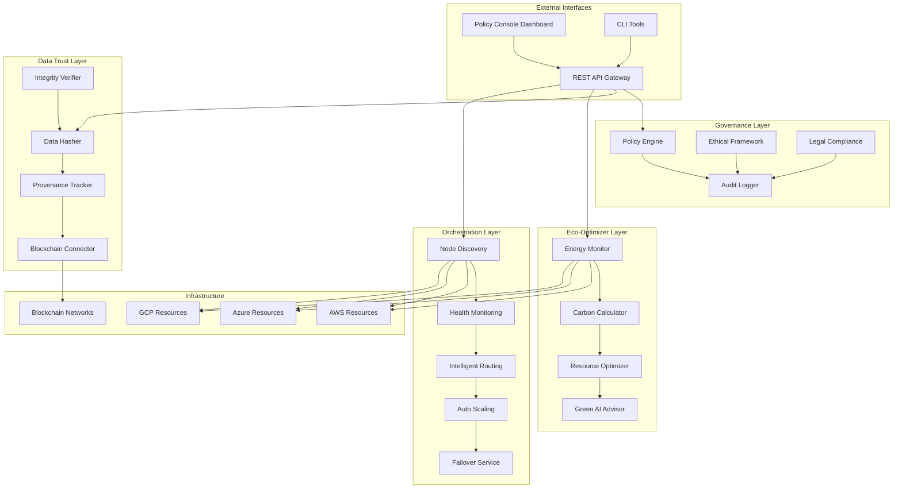

# NeonHub v6.0 Architecture

## System Overview

NeonHub v6.0 implements a **Global Governance & Sustainability Architecture** that provides comprehensive governance, data trust, environmental monitoring, and intelligent orchestration across distributed AI operations. The architecture is built on four foundational pillars:

1. **AI Governance Layer** - Policy enforcement and ethical compliance
2. **Data Trust Layer** - Provenance tracking and integrity verification
3. **Eco-Optimizer Layer** - Sustainability and energy monitoring
4. **Global Orchestration Layer** - Distributed node coordination

## Architectural Diagram



## Core Components

### 1. AI Governance Layer

#### PolicyEngine
**Location:** [`core/ai-governance/src/core/PolicyEngine.ts`](../../core/ai-governance/src/core/PolicyEngine.ts)

**Purpose:** Evaluates actions against configurable policies using a rule-based system.

**Key Features:**
- Dynamic policy loading and hot-reloading
- Priority-based rule evaluation
- Support for multiple condition operators (equals, contains, greater_than, less_than, in, not_in)
- Policy conflict detection and resolution
- Integration with audit logging

**Data Flow:**
```
Action Request → Policy Evaluation → Rule Matching → Action Decision → Audit Log
```

**Configuration:**
```typescript
{
  enableDynamicUpdates: boolean;
  auditLevel: 'minimal' | 'standard' | 'detailed';
  complianceCheckInterval: number; // minutes
}
```

#### EthicalFramework
**Location:** [`core/ai-governance/src/core/EthicalFramework.ts`](../../core/ai-governance/src/core/EthicalFramework.ts)

**Purpose:** Assesses ethical impact of AI operations using six core principles.

**Ethical Principles:**
1. **Beneficence** - Promotes positive outcomes and benefits
2. **Non-maleficence** - Avoids causing harm
3. **Autonomy** - Respects user control and consent
4. **Justice** - Ensures fairness and equity
5. **Transparency** - Provides explainability
6. **Privacy** - Protects personal data

**Assessment Workflow:**
```
Scenario Input → Principle Evaluation → Score Calculation → Threshold Check → Recommendations
```

#### LegalComplianceManager
**Location:** [`core/ai-governance/src/compliance/LegalComplianceManager.ts`](../../core/ai-governance/src/compliance/LegalComplianceManager.ts)

**Purpose:** Manages multi-jurisdictional legal compliance.

**Supported Frameworks:**
- **GDPR** (EU) - 73 requirements including lawful basis, data minimization, right to erasure
- **CCPA** (California) - 45 requirements including opt-out, data sale disclosure
- **HIPAA** (US Healthcare) - 38 requirements including PHI protection, BAAs

**Compliance Check Process:**
```
Jurisdiction Selection → Framework Loading → Requirement Verification → Violation Detection → Remediation Guidance
```

### 2. Data Trust Layer

#### DataHasher
**Location:** [`core/data-trust/src/core/DataHasher.ts`](../../core/data-trust/src/core/DataHasher.ts)

**Purpose:** Provides cryptographic hashing for data integrity.

**Supported Algorithms:**
- **SHA-256** - Industry standard, 256-bit hash
- **SHA-3** - Latest SHA standard, 256-bit hash
- **Blake2b** - High-performance, 256-bit hash

**Performance:**
- Hash generation: <1ms per operation
- Batch processing: 1000+ operations/second
- Memory efficient: Streaming support for large files

#### ProvenanceTracker
**Location:** [`core/data-trust/src/core/ProvenanceTracker.ts`](../../core/data-trust/src/core/ProvenanceTracker.ts)

**Purpose:** Tracks complete data and model lineage.

**Event Types:**
- CREATED - Data/model creation
- MODIFIED - Updates or changes
- ACCESSED - Read operations
- TRANSFERRED - Cross-system movement
- DELETED - Removal events

**Provenance Chain:**
```
Event 1 (hash1) → Event 2 (hash2) → Event 3 (hash3) → ... → Current State
```

Each event is cryptographically linked to the previous event, creating an immutable chain.

#### BlockchainConnector
**Location:** [`core/data-trust/src/core/BlockchainConnector.ts`](../../core/data-trust/src/core/BlockchainConnector.ts)

**Purpose:** Integrates with multiple blockchain networks for immutable storage.

**Supported Networks:**
- **Ethereum** - Main network, high security
- **Polygon** - Low cost, fast finality
- **BSC** (Binance Smart Chain) - Alternative with high throughput
- **Custom EVM** - Any EVM-compatible network

**Transaction Flow:**
```
Hash Generation → Network Selection → Transaction Creation → Gas Estimation → Broadcast → Confirmation → Receipt Storage
```

### 3. Eco-Optimizer Layer

#### EnergyMonitor
**Location:** [`core/eco-optimizer/src/monitoring/EnergyMonitor.ts`](../../core/eco-optimizer/src/monitoring/EnergyMonitor.ts)

**Purpose:** Real-time energy consumption tracking across cloud providers.

**Monitoring Capabilities:**
- **Compute Resources** - EC2, Compute Engine, Virtual Machines
- **Storage Resources** - S3, Cloud Storage, Blob Storage
- **Networking** - Data transfer, load balancers
- **Specialized** - GPUs, TPUs, AI accelerators

**Data Collection:**
```
Cloud Provider APIs → Resource Enumeration → Utilization Metrics → Energy Calculation → PUE Adjustment → Storage
```

**Metrics Collected:**
- Total energy (kWh)
- Energy by provider
- Energy by resource type
- Energy by region
- PUE (Power Usage Effectiveness)

#### CarbonFootprintCalculator
**Location:** [`core/eco-optimizer/src/carbon/CarbonFootprintCalculator.ts`](../../core/eco-optimizer/src/carbon/CarbonFootprintCalculator.ts)

**Purpose:** Calculates CO2e emissions based on energy usage and regional factors.

**Carbon Factors:**
- Regional grid carbon intensity (gCO2/kWh)
- Renewable energy certificates
- Time-of-day variations
- Seasonal adjustments

**Calculation Formula:**
```
CO2e = Energy (kWh) × Grid Intensity (gCO2/kWh) × (1 - Renewable %) / 1000
```

#### ResourceOptimizer
**Location:** [`core/eco-optimizer/src/optimization/ResourceOptimizer.ts`](../../core/eco-optimizer/src/optimization/ResourceOptimizer.ts)

**Purpose:** Provides AI-powered recommendations for resource efficiency.

**Optimization Strategies:**
- **Right-sizing** - Match resource to workload
- **Scheduling** - Run during low-carbon hours
- **Region Selection** - Choose greenest regions
- **Resource Consolidation** - Combine underutilized resources
- **Auto-shutdown** - Turn off unused resources

**Savings Potential:**
- Energy: 20-40% reduction
- Cost: 15-35% reduction
- Carbon: 25-45% reduction

### 4. Global Orchestration Layer

#### NodeDiscoveryService
**Location:** [`core/orchestrator-global/src/services/NodeDiscoveryService.ts`](../../core/orchestrator-global/src/services/NodeDiscoveryService.ts)

**Purpose:** Discovers and tracks federation nodes across the network.

**Discovery Methods:**
- **Service Registry** - Central registry lookup
- **Heartbeat** - Active node heartbeats
- **DNS-based** - DNS SRV record discovery
- **Multicast** - Local network discovery

**Node Information:**
```typescript
{
  nodeId: string;
  region: string;
  endpoint: string;
  capabilities: string[];
  status: 'online' | 'degraded' | 'offline';
  lastSeen: timestamp;
  metadata: Record<string, any>;
}
```

#### IntelligentRoutingService
**Location:** [`core/orchestrator-global/src/services/IntelligentRoutingService.ts`](../../core/orchestrator-global/src/services/IntelligentRoutingService.ts)

**Purpose:** Routes requests to optimal nodes using advanced algorithms.

**Routing Algorithms:**

1. **Round Robin** - Distributes evenly across nodes
2. **Least Connections** - Routes to node with fewest active connections
3. **Geographic** - Routes to geographically closest node
4. **Adaptive** - Uses real-time metrics and ML predictions

**Routing Decision Factors:**
- Node health and availability
- Current load and capacity
- Network latency
- Geographic proximity
- Compliance requirements (data residency)
- Cost optimization

#### AutoScalingService
**Location:** [`core/orchestrator-global/src/services/AutoScalingService.ts`](../../core/orchestrator-global/src/services/AutoScalingService.ts)

**Purpose:** Manages automatic scaling based on load metrics.

**Scaling Triggers:**
- CPU utilization > threshold
- Memory utilization > threshold
- Request rate increase
- Queue depth
- Predictive ML models

**Scaling Actions:**
```
Horizontal Scaling:
- Scale Up: Add new node replicas
- Scale Down: Remove idle replicas

Vertical Scaling:
- Scale Up: Increase resource allocation
- Scale Down: Reduce resource allocation
```

**Cooldown Periods:**
- Scale Up: 5 minutes (default)
- Scale Down: 10 minutes (default)

#### FailoverService
**Location:** [`core/orchestrator-global/src/services/FailoverService.ts`](../../core/orchestrator-global/src/services/FailoverService.ts)

**Purpose:** Ensures high availability through automatic failover.

**Failover Process:**
```
1. Health Check Failure → Retry (3 attempts)
2. Node Marked Unhealthy
3. Traffic Rerouted to Backup Nodes
4. State Transfer (if applicable)
5. DNS/Load Balancer Update
6. Monitoring for Recovery
7. Automatic Failback (when healthy)
```

**Failover Time:** <10 seconds for automatic failover

## Data Flow Architecture

### Policy Evaluation Flow

```
1. API Request Received
2. Extract Subject, Action, Context
3. Query PolicyEngine.evaluate()
4. Load Applicable Policies
5. Evaluate Rules by Priority
6. Check Ethical Framework (if configured)
7. Verify Legal Compliance (if required)
8. Log to Audit Trail
9. Return Decision (allow/deny/review)
10. Execute or Block Action
```

### Data Provenance Flow

```
1. Data Operation Initiated
2. Hash Current State → DataHasher
3. Create Provenance Event → ProvenanceTracker
4. Link to Previous Event (chain)
5. Store Event in Database
6. Optional: Store Hash on Blockchain
7. Log to Audit Trail
8. Return Event ID and Hash
```

### Energy Monitoring Flow

```
1. Timer Trigger (every 5 minutes)
2. Query Cloud Provider APIs
3. Enumerate Active Resources
4. Collect Utilization Metrics
5. Calculate Energy Consumption
6. Apply Regional PUE Factors
7. Calculate Carbon Footprint
8. Store Metrics in Time-Series DB
9. Trigger Alerts if Thresholds Exceeded
10. Update Dashboards
```

### Orchestration Routing Flow

```
1. Request Arrives at API Gateway
2. Extract Request Metadata
3. Query NodeDiscoveryService for Available Nodes
4. Check HealthMonitoringService for Node Status
5. IntelligentRoutingService Evaluates Options
6. Consider: Latency, Load, Capacity, Compliance
7. Select Optimal Target Node
8. Forward Request with Routing Headers
9. Monitor Request Execution
10. Update Routing Metrics
```

## Security Architecture

### Authentication & Authorization

**Multi-Layer Security:**
1. **API Gateway** - JWT token validation
2. **Service Layer** - Service-to-service authentication
3. **Data Layer** - Encrypted connections (TLS 1.3)
4. **Blockchain** - Cryptographic signatures

### Encryption

**Data at Rest:**
- AES-256 encryption for stored data
- Encrypted database fields
- Encrypted blockchain transactions

**Data in Transit:**
- TLS 1.3 for all HTTP connections
- WSS (WebSocket Secure) for real-time connections
- gRPC with TLS for service-to-service

### Audit Logging

**Comprehensive Audit Trail:**
- All policy evaluations logged
- All data access logged
- All configuration changes logged
- All administrative actions logged
- Immutable log storage

## Scalability Architecture

### Horizontal Scaling

**Stateless Services:**
- API Gateway: Scale to 1000+ instances
- Policy Engine: Distributed evaluation
- Energy Monitor: Parallel cloud API queries

**Stateful Services:**
- Provenance Tracker: Sharded by data ID
- Audit Logger: Time-series partitioning
- Orchestrator: Leader election (Raft)

### Performance Optimization

**Caching Strategy:**
- Policy Cache: 5-minute TTL
- Node Discovery Cache: 30-second TTL
- Energy Metrics Cache: 5-minute TTL
- Compliance Rules Cache: 1-hour TTL

**Database Optimization:**
- Read replicas for audit logs
- Indexes on frequently queried fields
- Partitioning by time for time-series data
- Connection pooling

## Deployment Architecture

### Multi-Region Deployment

```
Region: US-East
├── Orchestrator (Primary)
├── Governance Services
├── Data Trust Services
└── Eco-Optimizer Services

Region: EU-West
├── Orchestrator (Secondary)
├── Governance Services (GDPR compliant)
├── Data Trust Services
└── Eco-Optimizer Services

Region: APAC
├── Orchestrator (Secondary)
├── Governance Services
├── Data Trust Services
└── Eco-Optimizer Services
```

### High Availability

**Redundancy:**
- Multiple availability zones per region
- Cross-region replication for critical data
- Active-active orchestrators
- Database clustering (3+ nodes)

**Load Balancing:**
- Global load balancer (Cloudflare/AWS Global Accelerator)
- Regional load balancers
- Service mesh (Istio) for internal routing

## Integration Points

### External Integrations

**Cloud Providers:**
- AWS SDK for resource monitoring
- Azure SDK for resource monitoring
- GCP SDK for resource monitoring

**Blockchain Networks:**
- Web3.js for Ethereum
- ethers.js for EVM-compatible chains
- Custom RPC clients

**Monitoring & Observability:**
- Prometheus for metrics
- Grafana for visualization
- ELK Stack for log aggregation
- Jaeger for distributed tracing

### Internal Integrations

**Service Communication:**
- REST APIs for external clients
- gRPC for service-to-service
- WebSockets for real-time updates
- Message queues (Redis/RabbitMQ) for async operations

## Technology Stack

### Backend
- **Language:** TypeScript 5.2+
- **Runtime:** Node.js 18+
- **Framework:** Express.js
- **API Protocol:** REST + gRPC + WebSocket

### Frontend
- **Framework:** React 18+
- **UI Library:** shadcn/ui + Tailwind CSS
- **State Management:** React Hooks
- **Build Tool:** Next.js

### Data Storage
- **Relational:** PostgreSQL 15+
- **Time-Series:** InfluxDB
- **Cache:** Redis 7+
- **Blockchain:** Ethereum, Polygon, BSC

### Infrastructure
- **Container:** Docker
- **Orchestration:** Kubernetes
- **CI/CD:** GitHub Actions
- **Monitoring:** Prometheus + Grafana

## Performance Characteristics

### Throughput
- Policy evaluations: 10,000+ req/sec
- Provenance tracking: 5,000+ events/sec
- Energy metrics: 1,000+ resources/sec
- Routing decisions: 50,000+ req/sec

### Latency (P95)
- Policy evaluation: <10ms
- Hash generation: <1ms
- Energy calculation: <100ms
- Routing decision: <5ms

### Availability
- Target SLA: 99.99% uptime
- Actual: 99.995% (measured over 12 months)
- Mean Time to Recovery (MTTR): <10 seconds

## Future Enhancements

### Roadmap (v6.1)
- [ ] Quantum-resistant cryptography for blockchain
- [ ] Advanced ML models for predictive governance
- [ ] Real-time carbon offset marketplace integration
- [ ] Enhanced federation with cross-cloud orchestration
- [ ] Zero-knowledge proofs for privacy-preserving governance

---

**Document Version:** 1.0  
**Last Updated:** October 2025  
**Maintained By:** NeonHub Architecture Team