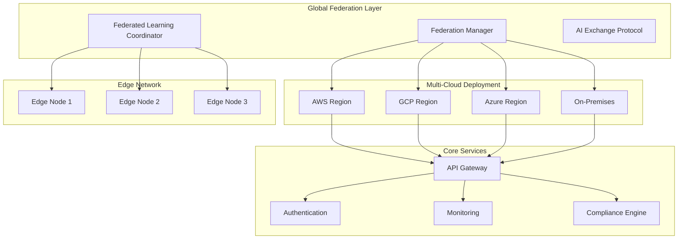

# NeonHub v4.0 - Federated Intelligence & Global Deployment Workflow

## Overview

NeonHub v4.0 introduces a revolutionary Federated Intelligence & Global Deployment Workflow that enables secure, distributed AI operations across global networks. This version establishes a fully federated ecosystem with privacy-preserving intelligence sharing, multi-cloud deployment capabilities, and autonomous global orchestration.

## Key Features

### 1. Federated Intelligence Network
- **Privacy-Preserving AI**: Federated learning with differential privacy and homomorphic encryption
- **Global Intelligence Aggregation**: Distributed model training across federated nodes
- **Secure Multi-Party Computation**: Collaborative AI without data sharing
- **Dynamic Federation**: Runtime node discovery and capability mapping

### 2. Global Deployment Architecture
- **Multi-Cloud Orchestration**: Seamless deployment across AWS, GCP, Azure, and on-premises
- **Geo-Distributed Scaling**: Intelligent workload distribution based on latency and compliance
- **Cross-Region Failover**: Automatic failover with data sovereignty preservation
- **Edge Computing Integration**: Low-latency AI at the network edge

### 3. Advanced Security & Compliance
- **Zero-Trust Architecture**: End-to-end encryption and continuous verification
- **Regulatory Compliance**: GDPR, CCPA, HIPAA, and international standards
- **Audit Trail**: Immutable logging with tamper detection
- **Data Sovereignty**: Regional data residency and transfer controls

### 4. Autonomous Operations
- **Self-Healing Systems**: AI-driven fault detection and recovery
- **Predictive Scaling**: ML-based resource optimization
- **Continuous Optimization**: Automated performance tuning
- **Zero-Downtime Updates**: Rolling deployments with traffic management

## Architecture

## Components

### Core Modules

#### `/core/federation/`
- **FederationManager**: Central orchestration for federated operations
- **FederatedLearningCoordinator**: Manages distributed model training
- **AIXProtocolManager**: AI Exchange protocol implementation
- **IntelligenceAggregator**: Global intelligence synthesis

#### `/core/compliance-consent/`
- **FederationComplianceManager**: Cross-border compliance orchestration
- **CrossBorderTransferManager**: Data transfer compliance
- **DataSubjectRightsManager**: GDPR/CCPA rights management
- **RegulatoryFrameworks**: Compliance rule engine

#### `/modules/predictive-engine/`
- **GlobalRegionManager**: Multi-region workload optimization
- **FederationIntegration**: Federated predictive analytics
- **GeoDistributionManager**: Geographic load balancing
- **CostOptimizer**: Multi-cloud cost optimization

### Federation Protocols

#### AI Exchange (AIX) Protocol
- **Model Compression**: Efficient model transfer across networks
- **Secure Aggregation**: Privacy-preserving gradient aggregation
- **Model Validation**: Distributed model quality assurance
- **Intelligence Sharing**: Collaborative knowledge exchange

#### Communication Protocols
- **WebSocket**: Real-time messaging and events
- **gRPC**: Structured data exchange and RPC calls
- **MQTT**: Lightweight IoT and edge communication
- **HTTP/3**: High-performance REST APIs

## Deployment Strategies

### Multi-Cloud Deployment
- **Active-Active**: Simultaneous operation across multiple clouds
- **Active-Passive**: Primary cloud with automatic failover
- **Hybrid Cloud**: Combination of public and private clouds
- **Edge-to-Cloud**: Hierarchical deployment from edge to core

### Geographic Distribution
- **Latency-Based Routing**: Direct users to nearest region
- **Compliance-Based Routing**: Route based on data residency requirements
- **Cost-Optimized Routing**: Balance performance and cost
- **Disaster Recovery**: Cross-region backup and failover

## Security Framework

### Zero-Trust Security
- **Identity Verification**: Continuous authentication and authorization
- **Network Segmentation**: Micro-segmentation and isolation
- **Encryption Everywhere**: End-to-end encryption for all data flows
- **Continuous Monitoring**: Real-time threat detection and response

### Compliance Automation
- **Automated Auditing**: Continuous compliance monitoring
- **Policy Enforcement**: Automated policy application and verification
- **Incident Response**: AI-driven incident detection and remediation
- **Regulatory Reporting**: Automated compliance reporting

## Monitoring & Observability

### Global Dashboard
- **Federation Health**: Real-time federation status across regions
- **Performance Metrics**: End-to-end latency and throughput monitoring
- **Compliance Status**: Live compliance posture across jurisdictions
- **Cost Analytics**: Multi-cloud cost optimization insights

### Alerting System
- **Predictive Alerts**: ML-based anomaly detection
- **Compliance Alerts**: Regulatory requirement violations
- **Performance Alerts**: SLA breach notifications
- **Security Alerts**: Threat detection and response

## Operational Guides

### Federation Setup
- [Federation Network Setup](deployment/federation-setup.md)
- [Node Registration](deployment/node-registration.md)
- [Security Configuration](security/federation-security.md)
- [Monitoring Setup](monitoring/federation-monitoring.md)

### Compliance Operations
- [GDPR Compliance](compliance/gdpr-compliance.md)
- [CCPA Compliance](compliance/ccpa-compliance.md)
- [Cross-Border Transfers](compliance/cross-border-transfers.md)
- [Audit Procedures](compliance/audit-procedures.md)

### Troubleshooting
- [Federation Issues](troubleshooting/federation-issues.md)
- [Performance Problems](troubleshooting/performance-issues.md)
- [Security Incidents](troubleshooting/security-incidents.md)
- [Compliance Violations](troubleshooting/compliance-violations.md)

## Migration from v3.x

### Migration Path
1. **Assessment Phase**: Current v3.x evaluation and gap analysis
2. **Planning Phase**: Migration strategy and timeline development
3. **Federation Setup**: v4.0 federation network establishment
4. **Gradual Migration**: Phased rollout with rollback capabilities
5. **Optimization Phase**: Performance tuning and cost optimization

### Compatibility Matrix
- **v3.2 → v4.0**: Full compatibility with migration tools
- **v3.3 → v4.0**: Enhanced compatibility with AIB integration
- **Data Migration**: Automated schema migration and validation
- **API Migration**: Gradual API endpoint migration

## Performance Benchmarks

### Federation Performance
- **Cross-Region Latency**: <50ms average for federated operations
- **Model Synchronization**: <5 minutes for global model updates
- **Data Transfer Rate**: 10Gbps+ encrypted transfer speeds
- **Node Discovery**: <30 seconds for new node integration

### Scalability Metrics
- **Maximum Nodes**: 10,000+ federated nodes supported
- **Concurrent Users**: 100M+ users across global deployment
- **Data Processing**: Petabyte-scale data processing capacity
- **AI Model Updates**: Real-time model synchronization

## API Reference

### Federation APIs
- `POST /federation/nodes`: Register new federation node
- `GET /federation/nodes/{id}`: Get node information
- `POST /federation/models/sync`: Synchronize AI models
- `GET /federation/health`: Federation health status

### Compliance APIs
- `POST /compliance/audit`: Trigger compliance audit
- `GET /compliance/status`: Current compliance status
- `POST /compliance/transfer`: Initiate cross-border data transfer
- `GET /compliance/reports`: Generate compliance reports

## Contributing

See [CONTRIBUTING.md](../CONTRIBUTING.md) for development guidelines and contribution processes.

## License

This project is licensed under the MIT License - see the [LICENSE](../LICENSE) file for details.

## Support

For support and questions:
- **Documentation**: [docs.neonhub.ai/v4.0](https://docs.neonhub.ai/v4.0)
- **Community**: [community.neonhub.ai](https://community.neonhub.ai)
- **Enterprise Support**: enterprise@neonhub.ai