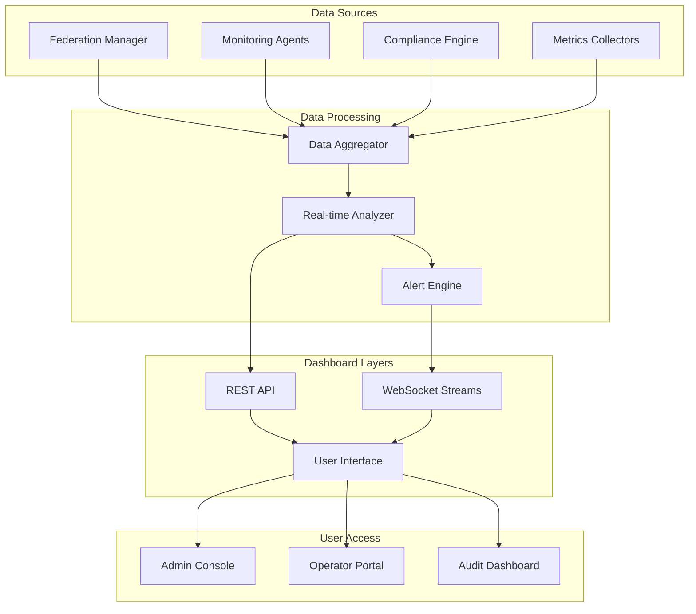

# Global Federation Dashboard Documentation

## Overview

The Global Federation Dashboard provides comprehensive monitoring and management capabilities for NeonHub v4.0's federated intelligence ecosystem, offering real-time visibility into federation health, performance metrics, compliance status, and operational insights across global deployments.

## Dashboard Architecture



## Core Dashboard Components

### 1. Federation Health Overview

#### Global Federation Status
```typescript
// Federation health dashboard interface
interface FederationHealthDashboard {
  summary: {
    totalNodes: number;
    activeNodes: number;
    healthyNodes: number;
    degradedNodes: number;
    offlineNodes: number;
    federationUptime: number;
  };
  regionalStatus: {
    [region: string]: {
      nodeCount: number;
      healthScore: number;
      latency: number;
      throughput: number;
      lastUpdate: Date;
    };
  };
  alerts: {
    critical: Alert[];
    warning: Alert[];
    info: Alert[];
  };
}
```

#### Real-time Health Metrics
- **Node Connectivity**: Live status of all federation nodes
- **Network Latency**: Cross-region communication performance
- **Message Throughput**: Federation message processing rates
- **Error Rates**: System error and failure metrics
- **Resource Utilization**: CPU, memory, and storage across nodes

### 2. Intelligence Flow Monitoring

#### AI Exchange (AIX) Protocol Metrics
```typescript
// AIX protocol monitoring
interface AIXMonitoring {
  modelUpdates: {
    totalExchanges: number;
    successfulTransfers: number;
    failedTransfers: number;
    averageTransferTime: number;
    compressionRatio: number;
  };
  federatedLearning: {
    activeRounds: number;
    completedRounds: number;
    participantCount: number;
    modelAccuracy: number;
    convergenceRate: number;
  };
  intelligenceSharing: {
    knowledgeExchanges: number;
    dataVolume: number;
    privacyBudgetUsage: number;
    securityIncidents: number;
  };
}
```

#### Federated Learning Progress
- **Training Rounds**: Active and completed learning cycles
- **Model Performance**: Accuracy and convergence metrics
- **Participant Engagement**: Node participation rates
- **Privacy Metrics**: Differential privacy budget usage

### 3. Compliance and Security Dashboard

#### Regulatory Compliance Status
```typescript
// Compliance monitoring dashboard
interface ComplianceDashboard {
  gdpr: {
    dataSubjectRequests: number;
    processingActivities: number;
    breachIncidents: number;
    complianceScore: number;
    lastAudit: Date;
  };
  ccpa: {
    accessRequests: number;
    deletionRequests: number;
    optOutRequests: number;
    violationReports: number;
  };
  crossBorder: {
    activeTransfers: number;
    riskAssessments: number;
    safeguardCompliance: number;
    incidentReports: number;
  };
  security: {
    activeThreats: number;
    blockedAttacks: number;
    encryptionStatus: string;
    accessViolations: number;
  };
}
```

#### Security Monitoring
- **Threat Detection**: Real-time security alerts
- **Access Control**: Authentication and authorization metrics
- **Encryption Status**: End-to-end encryption verification
- **Audit Trails**: Compliance audit logging

### 4. Performance Analytics

#### Global Performance Metrics
```typescript
// Performance analytics interface
interface PerformanceAnalytics {
  responseTimes: {
    averageLatency: number;
    p95Latency: number;
    p99Latency: number;
    regionalBreakdown: { [region: string]: number };
  };
  throughput: {
    messagesPerSecond: number;
    dataTransferRate: number;
    apiCallsPerMinute: number;
    peakLoadTimes: Date[];
  };
  scalability: {
    autoScalingEvents: number;
    resourceUtilization: number;
    costEfficiency: number;
    performanceDegradation: number;
  };
}
```

#### Cost Optimization Insights
- **Multi-Cloud Costs**: Real-time cost monitoring across providers
- **Resource Efficiency**: Utilization vs. cost analysis
- **Optimization Recommendations**: Automated cost-saving suggestions
- **Budget Tracking**: Spending against allocated budgets

## Dashboard Features

### Real-Time Updates

#### WebSocket Streaming
```typescript
// Real-time dashboard updates
interface RealTimeUpdates {
  subscriptions: {
    federationHealth: boolean;
    performanceMetrics: boolean;
    securityAlerts: boolean;
    complianceEvents: boolean;
  };
  updateFrequency: {
    highPriority: 'real-time';
    mediumPriority: '5_seconds';
    lowPriority: '30_seconds';
  };
  dataCompression: boolean;
  reconnectionLogic: {
    enabled: true;
    maxRetries: 5;
    backoffMultiplier: 2;
  };
}
```

#### Live Data Visualization
- **Interactive Charts**: Real-time graphs and metrics
- **Geographic Maps**: Global node distribution and status
- **Heat Maps**: Performance and utilization visualization
- **Time Series**: Historical trends and predictions

### Alerting and Notifications

#### Alert Management System
```typescript
// Alert configuration and management
interface AlertManagement {
  alertTypes: {
    critical: {
      conditions: string[];
      channels: ['email', 'sms', 'slack', 'webhook'];
      escalation: 'immediate';
    };
    warning: {
      conditions: string[];
      channels: ['email', 'slack'];
      escalation: 'delayed';
    };
    info: {
      conditions: string[];
      channels: ['dashboard'];
      escalation: 'none';
    };
  };
  thresholds: {
    latencyThreshold: number;
    errorRateThreshold: number;
    complianceThreshold: number;
    securityThreshold: number;
  };
  snoozing: {
    enabled: true;
    maxDuration: '24_hours';
    autoUnsnooze: boolean;
  };
}
```

#### Notification Channels
- **Email**: Critical alerts and reports
- **SMS**: High-priority incidents
- **Slack/Webhook**: Team notifications
- **Dashboard**: In-app notifications

### Customizable Views

#### Role-Based Dashboards
```typescript
// Role-based dashboard configuration
interface RoleBasedDashboards {
  administrator: {
    views: ['global_overview', 'security_center', 'compliance_monitor'];
    permissions: ['full_access', 'configuration', 'alert_management'];
    customWidgets: boolean;
  };
  operator: {
    views: ['federation_health', 'performance_monitor', 'incident_response'];
    permissions: ['read_access', 'alert_acknowledgment', 'basic_configuration'];
    customWidgets: false;
  };
  auditor: {
    views: ['compliance_reports', 'audit_trails', 'access_logs'];
    permissions: ['read_only', 'report_generation'];
    customWidgets: false;
  };
}
```

#### Custom Widgets and Reports
- **Widget Library**: Pre-built dashboard components
- **Custom Queries**: Advanced metric filtering
- **Scheduled Reports**: Automated report generation
- **Export Capabilities**: Data export in multiple formats

## API Reference

### Dashboard REST API

#### Health Status Endpoint
```typescript
GET /api/v1/dashboard/health
Response: {
  "status": "healthy",
  "federation": {
    "nodes": 42,
    "active": 40,
    "degraded": 2,
    "offline": 0
  },
  "performance": {
    "latency": 45,
    "throughput": 1250,
    "errorRate": 0.02
  },
  "timestamp": "2025-10-16T21:26:30Z"
}
```

#### Metrics Endpoint
```typescript
GET /api/v1/dashboard/metrics?period=1h&granularity=5m
Response: {
  "metrics": [
    {
      "timestamp": "2025-10-16T21:20:00Z",
      "federation": {
        "activeNodes": 40,
        "messageThroughput": 1200,
        "averageLatency": 42
      },
      "compliance": {
        "gdprScore": 98.5,
        "ccpaScore": 97.2
      }
    }
  ]
}
```

#### Alerts Endpoint
```typescript
GET /api/v1/dashboard/alerts?status=active&severity=critical
Response: {
  "alerts": [
    {
      "id": "alert-123",
      "severity": "critical",
      "title": "Federation Node Offline",
      "description": "Node us-east-1-03 is offline",
      "timestamp": "2025-10-16T21:25:00Z",
      "acknowledged": false,
      "assignedTo": null
    }
  ]
}
```

### WebSocket Streams

#### Real-Time Metrics Stream
```typescript
// WebSocket connection for real-time updates
const ws = new WebSocket('wss://dashboard.neonhub.ai/stream');

ws.onmessage = (event) => {
  const data = JSON.parse(event.data);
  if (data.type === 'federation_health') {
    updateFederationHealth(data.payload);
  } else if (data.type === 'performance_metrics') {
    updatePerformanceCharts(data.payload);
  }
};

// Subscribe to specific metrics
ws.send(JSON.stringify({
  action: 'subscribe',
  channels: ['federation_health', 'performance_metrics']
}));
```

## Security and Access Control

### Authentication and Authorization
```typescript
// Dashboard security configuration
interface DashboardSecurity {
  authentication: {
    methods: ['oauth2', 'saml', 'jwt'];
    mfa: 'required';
    sessionTimeout: '8_hours';
  };
  authorization: {
    rbac: true;
    permissions: {
      view: ['read'],
      edit: ['write', 'delete'],
      admin: ['manage_users', 'system_config']
    };
  };
  audit: {
    loginEvents: true;
    dataAccess: true;
    configurationChanges: true;
    retention: '7_years';
  };
}
```

### Data Protection
- **Encryption**: All dashboard communications encrypted
- **Access Logging**: Comprehensive audit trails
- **Data Masking**: Sensitive data protection in displays
- **Session Security**: Secure session management

## Integration Capabilities

### Third-Party Integrations
```typescript
// Integration framework
interface ThirdPartyIntegrations {
  monitoring: {
    datadog: 'metrics_forwarding',
    newrelic: 'apm_integration',
    prometheus: 'metrics_collection'
  };
  alerting: {
    pagerduty: 'incident_management',
    opsgenie: 'alert_routing',
    slack: 'notification_channel'
  };
  collaboration: {
    jira: 'issue_tracking',
    confluence: 'documentation',
    teams: 'communication'
  };
}
```

### API Integrations
- **REST APIs**: Full programmatic access
- **Webhooks**: Event-driven notifications
- **GraphQL**: Flexible data querying
- **SDKs**: Language-specific client libraries

## Performance Optimization

### Dashboard Performance
```typescript
// Performance optimization settings
interface PerformanceOptimization {
  caching: {
    metricsCache: '5_minutes',
    dashboardCache: '1_minute',
    staticAssets: '24_hours'
  };
  dataSampling: {
    realTime: 'full_resolution',
    historical: 'adaptive_sampling',
    archival: 'aggregated_data'
  };
  lazyLoading: {
    widgets: true,
    historicalData: true,
    largeDatasets: true
  };
}
```

### Scalability Features
- **Horizontal Scaling**: Multi-instance deployment
- **Load Balancing**: Intelligent traffic distribution
- **Caching Layers**: Redis-based performance caching
- **Database Optimization**: Query optimization and indexing

## Troubleshooting and Support

### Common Issues
```typescript
// Troubleshooting guide
const troubleshootingGuide = {
  connectivity: {
    issue: 'Dashboard not loading',
    causes: ['network_issues', 'authentication_failures', 'service_down'],
    solutions: ['check_network', 'verify_credentials', 'restart_services']
  },
  performance: {
    issue: 'Slow dashboard response',
    causes: ['high_load', 'large_datasets', 'caching_issues'],
    solutions: ['scale_resources', 'optimize_queries', 'clear_cache']
  },
  data: {
    issue: 'Missing or incorrect metrics',
    causes: ['collection_failures', 'processing_errors', 'filter_issues'],
    solutions: ['check_collectors', 'verify_processing', 'adjust_filters']
  }
};
```

### Support Resources
- **Documentation**: Comprehensive online docs
- **API Reference**: Detailed API documentation
- **Community Forums**: User community support
- **Enterprise Support**: 24/7 technical support

## Future Enhancements

### Planned Features
- **AI-Powered Insights**: ML-driven anomaly detection
- **Predictive Analytics**: Forecasting and trend analysis
- **Advanced Visualizations**: 3D and augmented reality views
- **Mobile Applications**: Native mobile dashboard apps
- **Voice Commands**: Natural language dashboard interaction

This Global Federation Dashboard provides the central nervous system for monitoring and managing NeonHub v4.0's federated intelligence ecosystem, ensuring operational excellence and rapid response to any issues across the global network.