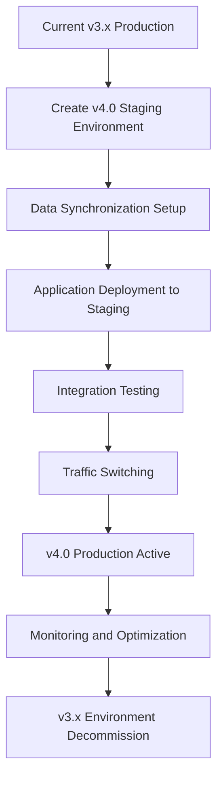
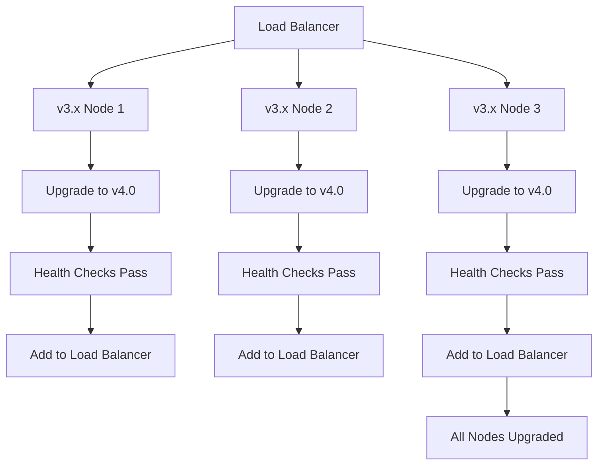

# Migration Guide: From v3.x to NeonHub v4.0

## Overview

This comprehensive migration guide provides step-by-step instructions for upgrading from NeonHub v3.x to v4.0. The migration process is designed to minimize downtime and ensure data integrity while introducing the new federated intelligence capabilities.

## Pre-Migration Assessment

### Compatibility Analysis

#### Version Compatibility Matrix

| Source Version | Target Version | Migration Path | Complexity | Downtime Required |
|----------------|----------------|----------------|------------|-------------------|
| v3.2.x | v4.0.0 | Direct upgrade | Medium | 2-4 hours |
| v3.3.x | v4.0.0 | Direct upgrade | Low | 1-2 hours |
| v3.1.x or earlier | v4.0.0 | Staged migration via v3.3 | High | 4-8 hours |

#### Component Compatibility

```typescript
// Compatibility assessment interface
interface CompatibilityAssessment {
  version: string;
  components: {
    [componentName: string]: {
      compatible: boolean;
      issues: string[];
      requiredActions: string[];
      breakingChanges: string[];
    };
  };
  dataMigration: {
    required: boolean;
    complexity: 'low' | 'medium' | 'high';
    estimatedDuration: number; // minutes
  };
  configurationChanges: {
    breaking: string[];
    deprecated: string[];
    newRequired: string[];
  };
}
```

### Resource Requirements Assessment

#### Infrastructure Requirements

```yaml
# v4.0 minimum requirements
minimumRequirements:
  cpu: 8
  memory: "16GB"
  storage: "100GB"
  network: "1Gbps"

# Recommended for production
recommendedRequirements:
  cpu: 16
  memory: "32GB"
  storage: "500GB"
  network: "10Gbps"

# Federation-specific requirements
federationRequirements:
  additionalCpu: 4
  additionalMemory: "8GB"
  additionalStorage: "200GB"
  crossRegionBandwidth: "5Gbps"
```

#### Database Migration Assessment

```sql
-- Pre-migration database analysis
SELECT
  table_name,
  table_rows,
  data_length / 1024 / 1024 as data_mb,
  index_length / 1024 / 1024 as index_mb
FROM information_schema.tables
WHERE table_schema = 'neonhub'
ORDER BY data_length DESC;

-- Check for incompatible data types
SELECT
  table_name,
  column_name,
  data_type,
  column_type
FROM information_schema.columns
WHERE table_schema = 'neonhub'
  AND data_type IN ('json', 'longtext', 'blob')
ORDER BY table_name, ordinal_position;
```

## Migration Planning

### Migration Strategy Selection

#### Blue-Green Deployment Strategy



#### Rolling Update Strategy



### Timeline Planning

#### Migration Phases

1. **Preparation Phase** (1-2 weeks)
   - Infrastructure provisioning
   - Compatibility testing
   - Data backup and validation
   - Team training and documentation review

2. **Execution Phase** (4-8 hours)
   - Database migration
   - Application deployment
   - Configuration updates
   - Testing and validation

3. **Post-Migration Phase** (1-2 weeks)
   - Performance monitoring
   - Issue resolution
   - Optimization
   - Documentation updates

#### Rollback Planning

```yaml
# Rollback strategy configuration
rollbackStrategy:
  type: blue-green
  backupRetention: 30
  automatedRollback: true
  rollbackTriggers:
    - errorRate > 0.05
    - latencyIncrease > 50%
    - functionalityDegraded: true
  rollbackTime: 15_minutes
  dataRecovery: point_in_time
```

## Pre-Migration Preparation

### Backup and Recovery Setup

#### Database Backup Strategy

```bash
#!/bin/bash
# Comprehensive backup script for v3.x to v4.0 migration

BACKUP_DIR="/backups/migration-$(date +%Y%m%d-%H%M%S)"
mkdir -p $BACKUP_DIR

# Database backup
docker exec neonhub-db pg_dump -U neonhub -h localhost neonhub > $BACKUP_DIR/database.sql

# Configuration backup
cp -r /etc/neonhub $BACKUP_DIR/config

# Application data backup
tar -czf $BACKUP_DIR/app-data.tar.gz /var/lib/neonhub/data

# Verify backup integrity
md5sum $BACKUP_DIR/* > $BACKUP_DIR/backup-checksums.md5

echo "Backup completed: $BACKUP_DIR"
```

#### Configuration Backup

```bash
# Configuration preservation script
CONFIG_BACKUP="/backups/config-$(date +%Y%m%d-%H%M%S)"
mkdir -p $CONFIG_BACKUP

# Environment variables
env | grep NEONHUB > $CONFIG_BACKUP/environment.env

# Docker configurations
cp docker-compose.yml $CONFIG_BACKUP/
cp docker-compose.override.yml $CONFIG_BACKUP/

# Application configurations
find /etc/neonhub -name "*.yml" -o -name "*.yaml" -o -name "*.json" | xargs cp -t $CONFIG_BACKUP/

# SSL certificates (without private keys)
find /etc/neonhub/certs -name "*.crt" -o -name "*.pem" | xargs cp -t $CONFIG_BACKUP/certs/
```

### Environment Preparation

#### Staging Environment Setup

```yaml
# staging-environment.yml
staging:
  infrastructure:
    provider: aws
    region: us-east-1
    instanceType: t3.large
    count: 3

  database:
    engine: postgresql
    version: "15"
    size: "100GB"

  networking:
    vpc: staging-vpc
    subnets:
      - public
      - private

  security:
    allowFrom: "10.0.0.0/8"
    bastionHost: true

  monitoring:
    enabled: true
    retention: 7_days
```

#### Testing Environment Validation

```bash
#!/bin/bash
# Pre-migration validation script

echo "=== Pre-Migration Validation ==="

# Check system resources
echo "CPU cores: $(nproc)"
echo "Memory: $(free -h | grep '^Mem:' | awk '{print $2}')"
echo "Disk space: $(df -h / | tail -1 | awk '{print $4}')"

# Validate network connectivity
echo "Testing network connectivity..."
curl -f https://registry.neonhub.ai/v4.0/manifest.json

# Check database connectivity
echo "Testing database connectivity..."
docker exec neonhub-db pg_isready -U neonhub

# Validate backup integrity
echo "Validating backup integrity..."
md5sum -c /backups/latest/backup-checksums.md5

echo "=== Validation Complete ==="
```

## Migration Execution

### Phase 1: Database Migration

#### Schema Migration

```sql
-- v4.0 schema migration script
BEGIN;

-- Create federation tables
CREATE TABLE federation_nodes (
    id UUID PRIMARY KEY DEFAULT gen_random_uuid(),
    node_id VARCHAR(255) UNIQUE NOT NULL,
    name VARCHAR(255) NOT NULL,
    region VARCHAR(100) NOT NULL,
    capabilities JSONB NOT NULL DEFAULT '[]',
    endpoints JSONB NOT NULL,
    resources JSONB NOT NULL,
    compliance JSONB NOT NULL,
    status VARCHAR(50) NOT NULL DEFAULT 'pending',
    created_at TIMESTAMP WITH TIME ZONE DEFAULT NOW(),
    updated_at TIMESTAMP WITH TIME ZONE DEFAULT NOW()
);

-- Create AIX protocol tables
CREATE TABLE aix_learning_rounds (
    id UUID PRIMARY KEY DEFAULT gen_random_uuid(),
    round_id VARCHAR(255) UNIQUE NOT NULL,
    model_id VARCHAR(255) NOT NULL,
    algorithm VARCHAR(100) NOT NULL,
    participants JSONB NOT NULL,
    status VARCHAR(50) NOT NULL DEFAULT 'initialized',
    privacy_config JSONB,
    created_at TIMESTAMP WITH TIME ZONE DEFAULT NOW(),
    completed_at TIMESTAMP WITH TIME ZONE
);

-- Migrate existing data
INSERT INTO federation_nodes (node_id, name, region, capabilities, endpoints, resources, compliance)
SELECT
    'legacy-node-1',
    'Migrated Legacy Node',
    COALESCE(region, 'us-east-1'),
    '["model_training", "inference"]'::jsonb,
    '{"api": "https://api.neonhub.ai"}'::jsonb,
    '{"cpu": 8, "memory": "16GB"}'::jsonb,
    '{"gdpr": true}'::jsonb
FROM legacy_nodes;

COMMIT;
```

#### Data Transformation

```typescript
// Data transformation script for v3.x to v4.0 migration
import { MigrationEngine } from '@neonhub/migration-engine';

const migrationEngine = new MigrationEngine({
  sourceVersion: '3.3',
  targetVersion: '4.0',
  dataTransformers: [
    {
      table: 'users',
      transformations: [
        // Add federation fields
        { action: 'add_column', name: 'federation_id', type: 'uuid', nullable: true },
        { action: 'add_column', name: 'node_id', type: 'varchar(255)', nullable: true },

        // Transform consent data
        {
          action: 'transform_column',
          source: 'consent_given',
          target: 'consent_records',
          transformer: (value) => ({
            version: '4.0',
            consentGiven: value,
            timestamp: new Date().toISOString(),
            scope: ['federated_learning', 'cross_border_processing']
          })
        }
      ]
    },
    {
      table: 'models',
      transformations: [
        // Add federation metadata
        { action: 'add_column', name: 'federation_metadata', type: 'jsonb', nullable: true },

        // Transform model data
        {
          action: 'transform_column',
          source: 'model_data',
          target: 'federation_model_data',
          transformer: (value) => ({
            originalVersion: '3.3',
            migratedAt: new Date().toISOString(),
            compressionEnabled: true,
            privacyPreserving: true,
            data: value
          })
        }
      ]
    }
  ]
});

// Execute migration
await migrationEngine.migrate();
```

### Phase 2: Application Deployment

#### Container Image Migration

```dockerfile
# Dockerfile for v4.0 migration
FROM neonhub/base:v4.0

# Copy v3.x application
COPY --from=neonhub:v3.3 /app /app/v3

# Install v4.0 components
RUN npm install @neonhub/federation @neonhub/aix-protocol @neonhub/compliance

# Migration configuration
ENV MIGRATION_MODE=true
ENV LEGACY_SUPPORT=true
ENV FEDERATION_ENABLED=false

# Health check for migration
HEALTHCHECK --interval=30s --timeout=10s --start-period=60s --retries=3 \
  CMD curl -f http://localhost:8080/health/migration || exit 1

# Start migration application
CMD ["node", "migration-app.js"]
```

#### Configuration Migration

```typescript
// Configuration migration utility
const configMigration = {
  v3toV4Mappings: {
    // Database configuration
    'database.host': 'database.host',
    'database.port': 'database.port',
    'database.name': 'database.name',
    'database.username': 'database.username',
    'database.password': 'database.password',

    // API configuration
    'api.port': 'api.port',
    'api.host': 'api.host',
    'api.ssl.enabled': 'api.tls.enabled',
    'api.ssl.cert': 'api.tls.certPath',
    'api.ssl.key': 'api.tls.keyPath',

    // New v4.0 configurations
    'federation.enabled': false, // Disabled during migration
    'federation.nodeId': null,   // To be set post-migration
    'aix.enabled': false,        // Disabled during migration
    'compliance.gdpr.enabled': true,
    'compliance.ccpa.enabled': true
  },

  migrateConfig: (v3Config: any) => {
    const v4Config = {};

    for (const [v3Key, v4Key] of Object.entries(configMigration.v3toV4Mappings)) {
      if (v3Config[v3Key] !== undefined) {
        _.set(v4Config, v4Key, v3Config[v3Key]);
      }
    }

    // Add v4.0 specific defaults
    v4Config.federation = {
      enabled: false,
      mode: 'migration'
    };

    v4Config.aix = {
      enabled: false,
      mode: 'migration'
    };

    return v4Config;
  }
};
```

### Phase 3: Federation Setup

#### Post-Migration Federation Configuration

```yaml
# federation-config.yml (post-migration)
federation:
  enabled: true
  nodeId: "migrated-node-1"
  coordinatorUrl: "https://federation.neonhub.ai"
  capabilities:
    - model_training
    - federated_learning
    - data_processing
    - inference

  security:
    tls:
      enabled: true
      certPath: "/etc/certs/server.crt"
      keyPath: "/etc/certs/server.key"
    authentication:
      type: "certificate"

  discovery:
    method: "coordinator"
    heartbeatInterval: 30
    reconnectDelay: 5

  compliance:
    gdpr: true
    ccpa: true
    dataResidency: "US"
```

#### Federation Node Registration

```bash
#!/bin/bash
# Post-migration federation registration

FEDERATION_API="https://federation.neonhub.ai/api/v1"

# Register migrated node
curl -X POST $FEDERATION_API/federation/nodes \
  -H "Authorization: Bearer $FEDERATION_TOKEN" \
  -H "Content-Type: application/json" \
  -d '{
    "nodeId": "migrated-node-1",
    "name": "Migrated Production Node",
    "region": "us-east-1",
    "capabilities": ["model_training", "federated_learning"],
    "endpoints": {
      "websocket": "wss://api.neonhub.ai:8080/federation",
      "grpc": "grpc://api.neonhub.ai:9090",
      "api": "https://api.neonhub.ai"
    },
    "resources": {
      "cpu": 16,
      "memory": "32GB",
      "gpu": 2
    },
    "compliance": {
      "gdpr": true,
      "ccpa": true,
      "dataResidency": "US"
    }
  }'

echo "Node registration complete"
```

## Testing and Validation

### Migration Testing Checklist

#### Functional Testing

```typescript
// Migration testing suite
const migrationTests = {
  database: {
    connectivity: async () => {
      const client = new DatabaseClient(v4Config.database);
      await client.connect();
      const result = await client.query('SELECT version()');
      return result.rows[0].version.includes('15');
    },

    dataIntegrity: async () => {
      const v3Count = await getV3RecordCount();
      const v4Count = await getV4RecordCount();
      return v3Count === v4Count;
    },

    schemaValidation: async () => {
      const schema = await getDatabaseSchema();
      return validateV4Schema(schema);
    }
  },

  api: {
    endpoints: async () => {
      const endpoints = [
        '/api/v1/health',
        '/api/v1/federation/status',
        '/api/v1/compliance/status'
      ];

      for (const endpoint of endpoints) {
        const response = await fetch(`${baseUrl}${endpoint}`);
        if (!response.ok) return false;
      }
      return true;
    },

    compatibility: async () => {
      // Test v3.x API compatibility mode
      const response = await fetch(`${baseUrl}/api/v3/health`);
      return response.ok;
    }
  },

  federation: {
    nodeRegistration: async () => {
      const nodeInfo = await federationApi.getNode('migrated-node-1');
      return nodeInfo.status === 'active';
    },

    connectivity: async () => {
      const health = await federationApi.healthCheck();
      return health.overall === 'healthy';
    }
  }
};
```

#### Performance Testing

```bash
#!/bin/bash
# Performance validation script

echo "=== Performance Testing ==="

# API response time testing
echo "Testing API response times..."
hey -n 1000 -c 10 https://api.neonhub.ai/api/v1/health

# Database query performance
echo "Testing database performance..."
docker exec neonhub-db pgbench -U neonhub -c 10 -j 2 -T 60 neonhub

# Federation message throughput
echo "Testing federation throughput..."
federation-benchmark --duration=300 --concurrency=50

echo "=== Performance Testing Complete ==="
```

### Rollback Procedures

#### Automated Rollback

```bash
#!/bin/bash
# Automated rollback script

echo "Initiating rollback to v3.x..."

# Stop v4.0 services
docker-compose -f docker-compose.v4.yml down

# Restore v3.x services
docker-compose -f docker-compose.v3.yml up -d

# Restore database from backup
docker exec neonhub-db psql -U neonhub -d neonhub < /backups/pre-migration/database.sql

# Update load balancer
kubectl apply -f load-balancer-v3.yml

# Verify rollback
curl -f https://api.neonhub.ai/api/v3/health

echo "Rollback complete"
```

#### Partial Rollback Scenarios

```typescript
// Partial rollback strategies
const rollbackStrategies = {
  databaseOnly: {
    steps: [
      'stop_application_services',
      'restore_database_backup',
      'restart_application_services'
    ],
    downtime: '10_minutes'
  },

  configurationOnly: {
    steps: [
      'restore_configuration_backup',
      'reload_application_config',
      'restart_affected_services'
    ],
    downtime: '5_minutes'
  },

  federationOnly: {
    steps: [
      'disable_federation_features',
      'restore_federation_config',
      'restart_federation_services'
    ],
    downtime: '2_minutes'
  }
};
```

## Post-Migration Optimization

### Performance Tuning

#### Database Optimization

```sql
-- Post-migration database optimization
-- Create indexes for new v4.0 queries
CREATE INDEX idx_federation_nodes_region ON federation_nodes(region);
CREATE INDEX idx_federation_nodes_status ON federation_nodes(status);
CREATE INDEX idx_aix_rounds_status ON aix_learning_rounds(status);
CREATE INDEX idx_aix_rounds_created_at ON aix_learning_rounds(created_at);

-- Analyze tables for query optimization
ANALYZE federation_nodes;
ANALYZE aix_learning_rounds;
ANALYZE compliance_audit_log;

-- Update table statistics
VACUUM ANALYZE;
```

#### Application Optimization

```typescript
// Performance optimization configuration
const performanceOptimization = {
  caching: {
    redis: {
      enabled: true,
      ttl: 3600,
      maxMemory: '2GB'
    },
    application: {
      enabled: true,
      strategy: 'lru',
      maxSize: 10000
    }
  },

  connectionPooling: {
    database: {
      min: 2,
      max: 20,
      idleTimeout: 30000
    },
    federation: {
      min: 5,
      max: 50,
      acquireTimeout: 60000
    }
  },

  asyncProcessing: {
    queueSize: 1000,
    workerThreads: 4,
    retryPolicy: {
      maxAttempts: 3,
      backoffMultiplier: 2
    }
  }
};
```

### Monitoring Setup

#### Post-Migration Monitoring

```yaml
# monitoring-config.yml (post-migration)
monitoring:
  prometheus:
    scrape_interval: 15s
    evaluation_interval: 15s
    retention: 30d

  grafana:
    dashboards:
      - federation-overview
      - aix-protocol-monitoring
      - compliance-dashboard
      - migration-health

  alerting:
    rules:
      - migration_complete_check
      - performance_regression_alert
      - data_integrity_monitor

  logging:
    level: info
    retention: 90d
    aggregation: elasticsearch
```

## Success Criteria and Validation

### Migration Success Metrics

```typescript
// Migration success validation
const successCriteria = {
  functional: {
    apiAvailability: '> 99.9%',
    dataIntegrity: '100%',
    featureParity: '95%'
  },

  performance: {
    responseTime: '< 10% increase',
    throughput: '> 90% of baseline',
    errorRate: '< 0.1%'
  },

  compliance: {
    gdprCompliance: 'maintained',
    ccpaCompliance: 'maintained',
    auditTrail: 'intact'
  },

  operational: {
    monitoringCoverage: '100%',
    alertingFunctionality: 'working',
    documentation: 'updated'
  }
};
```

### Go-Live Checklist

- [ ] All functional tests passing
- [ ] Performance benchmarks met
- [ ] Security assessment completed
- [ ] Compliance audit passed
- [ ] Backup and recovery tested
- [ ] Rollback procedures documented
- [ ] Team training completed
- [ ] Stakeholder communication sent
- [ ] Monitoring and alerting active
- [ ] Support team ready

## Support and Resources

### Migration Support

- **Migration Toolkit**: Automated migration scripts and tools
- **Technical Support**: 24/7 migration support team
- **Documentation**: Comprehensive migration guides and FAQs
- **Community**: User community and migration forums

### Post-Migration Resources

- **v4.0 Documentation**: Complete v4.0 feature documentation
- **Training Materials**: Updated training courses and materials
- **Best Practices**: v4.0 optimization and best practices guides
- **Support Portal**: Knowledge base and support ticket system

This migration guide ensures a smooth transition from NeonHub v3.x to v4.0 while maintaining system stability, data integrity, and operational continuity.